# Bill of Work — OpenNIRScap (OpenFNIRS) Assembly & Bench Bring-Up

| | |
|---|---|
| **Document** | BOW-ONC-2026-001, Rev D (2026-06-10) |
| **bci.place build ref** | OpenNIRScap v2 / bcf-0036 |
| **Governing spec** | `openfnirs-state-machine` (2026-06-02) — states N0–N12 |
| **Status** | Issued for quotation |
| **Quote basis** | Fixed price per work item WI-1…WI-9 — quotation table in §7 |

## 1. Scope

Turnkey **assembly + bench bring-up of one (1) OpenNIRScap unit**.

**In scope:** incoming board inspection, hand-solder of the called-out parts, header population, firmware flash, cap/cable integration, USB CDC framing, and bench bring-up through the host-validation proof gate (§8).
**Not in scope:** bare-PCB fabrication and factory SMT (procured separately by bci.place); new host-side software development; any human-subject use (§10).

## 2. Build quantities (one unit, "fixed-board model")

| Assembly | Qty |
|---|---|
| Sensor module | 8 |
| ECU | 1 |
| ST-LINK adapter board | 5 |

## 3. Boards as received (mixed assembly state)

Boards are bci.place-furnished and **arrive in mixed condition.** Confirm each against the WI-1 population map before adding parts:

| Board | As-received state | Assembler adds |
|---|---|---|
| Sensor module ×8 | **SMT-populated** (op-amp + passives) | Edge connector J1; bench-verify R1/R2/C1/C2/D1/D2 before any hand-add. U1 is AD8616 SOIC-8 placed by JLC; do not place AD8618ARUZ |
| ECU ×1 | **Partially populated** — top side populated; bottom side nearly bare (intentional, 4-layer internal routing); ribbon-cable and SWD headers empty | Power/USB parts, T1M-10 headers, mux inspection per WI-3 |
| ST-LINK adapter ×5 | **Bare** (unpopulated) | All headers per WI-4 |

⚠ A few component positions were cancelled at fab and shipped **unpopulated**. Treat any empty position as build state to reconcile against the population map — do **not** back-fill from the set-aside stock (§4) without an exact footprint/designator match.

### Reference photos — current boards and visible unfilled locations

**ECU (fNIRS ECU, Capstone Team):** green ECU board with SENSOR GROUP 1-8 labels and reference designators visible. Use for board identity, connector orientation, and incoming-condition reference only.

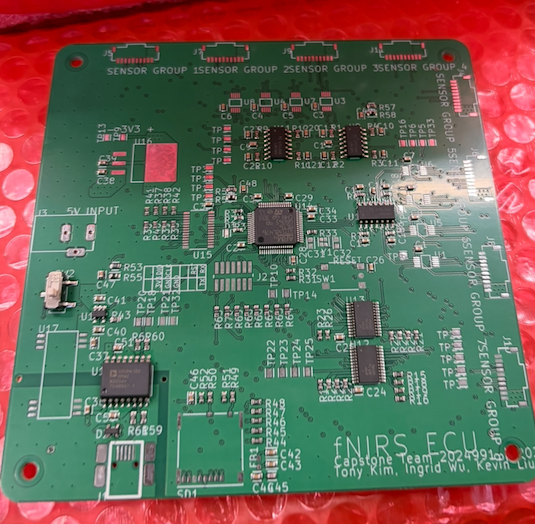

**Sensor module (x8):** use the current clear sensor photos for assembler-facing sensor identity, unfilled J1 evidence, and current board-state checks. Historical audit captures are audit evidence only, not final assembly instructions.

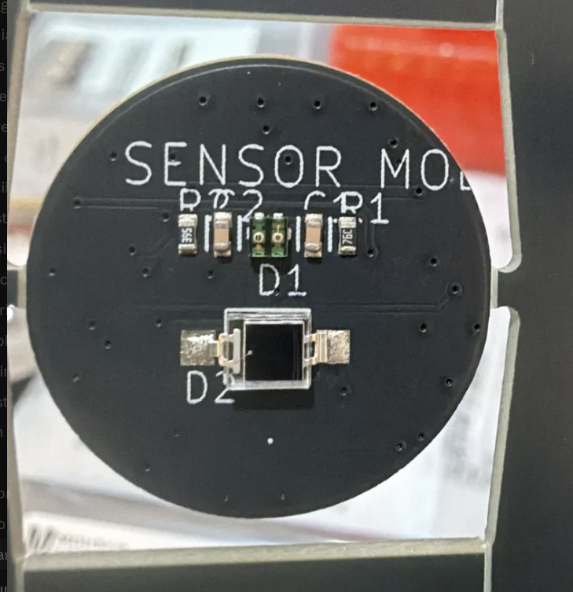

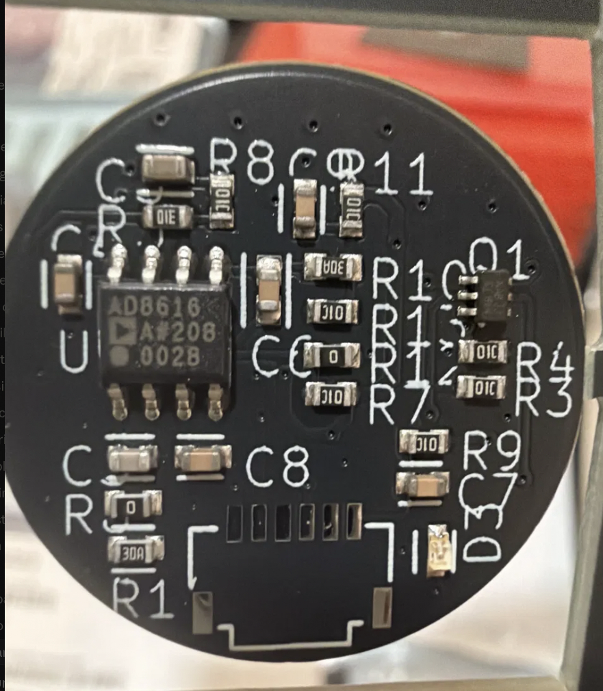

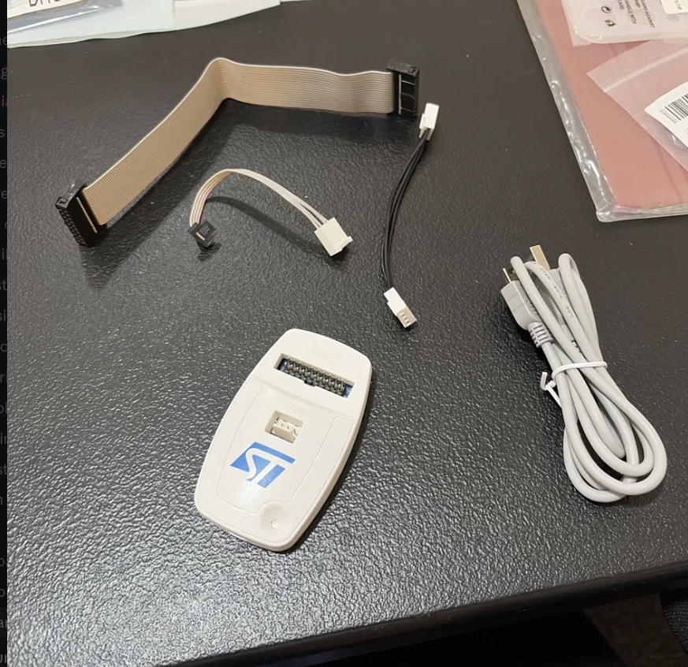

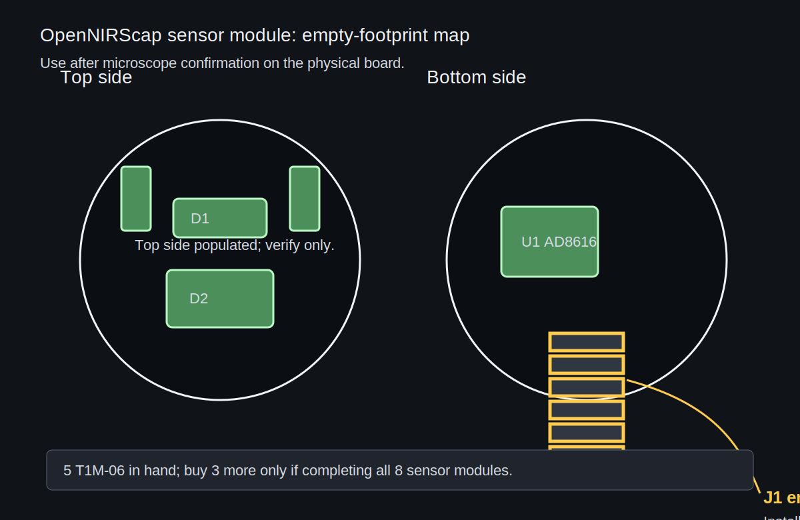

### Visual location map — missing, verify-only, and set-aside parts

| Board | Ref/location | Board image evidence | Part image / part-evidence image | Current status | Action |
|---|---|---|---|---|---|
| Sensor module ×8 | J1, bottom edge, six-pad 1 mm footprint | Current clear bottom photo + unfilled-location diagram | 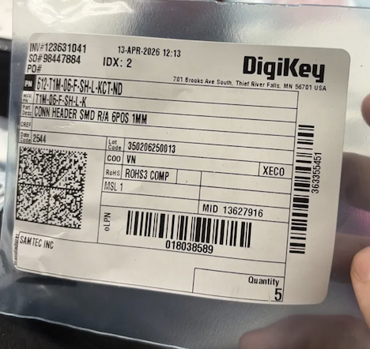 | Empty by design; 5 T1M-06 in hand for 8 boards | Buy 3× T1M-06-F-SH-L-K if completing all eight boards, then hand-solder all required J1 footprints |
| Sensor module ×8 | R1/R2/C1/C2 top-side analog network | Current clear top photo plus bench probing | If a real open/missing site is found: 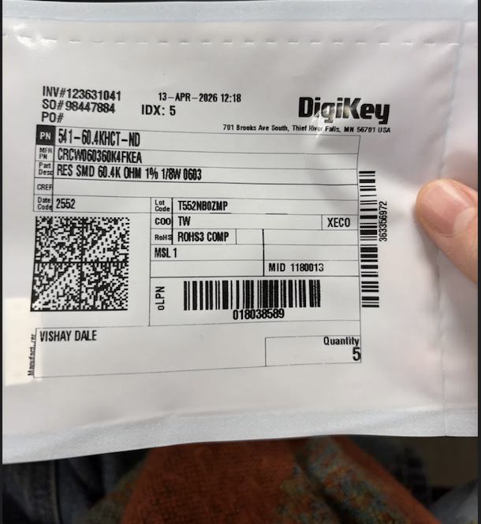 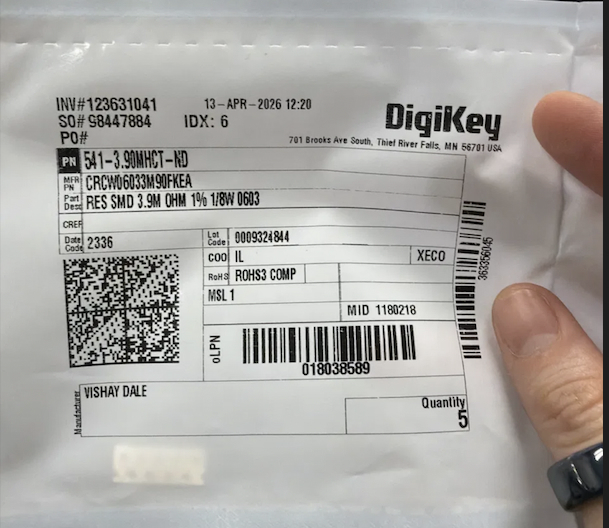 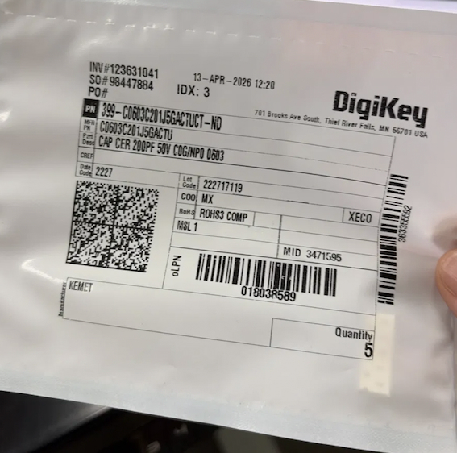 | Placement is verification-only unless microscope/probe check shows an actual missing part | Probe each board; hand-add only if open/missing |
| Sensor module ×8 | C3/U1/D3/Q1 bottom-side analog and indicator path | Current clear bottom photo plus bench probing | No current-fill image: the saved AD8618ARUZ image is spare/ECO evidence, not a placement instruction for current U1 | U1 is AD8616 SOIC-8; surrounding bottom-side locations appear populated or verification-only | Do not place AD8618ARUZ; verify value/function before any rework |
| Sensor module ×8 | D1/D2 top source/detector | Current clear top photo plus optical/electrical proof | No current-fill image in the saved packet; use optical/electrical proof before any diode claim | Verify optically/electrically; not a purchase task unless bench proof contradicts the board | Record proof; do not create a parts order from images alone |
| ECU ×1 | U3, top-left between "+3V3" and "5V INPUT" | ECU bench photo + May 27 checklist | 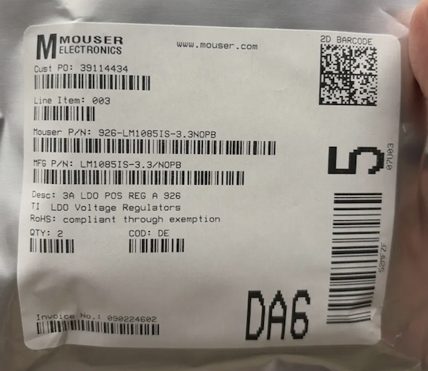 | Missing; LM1085ISX-3.3/NOPB in hand | Fit-check and solder before downstream population |
| ECU ×1 | J2 USB Mini-B by "5V INPUT" | ECU bench photo + May 27 checklist | 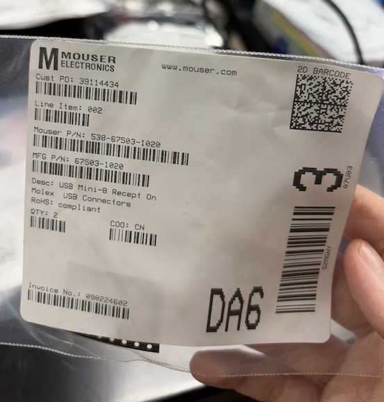 | Empty; Molex 67503-1020 in hand | Solder and prove USB +5 V/enumeration |
| ECU ×1 | SW1 reset tactile | ECU bench photo + May 27 checklist | 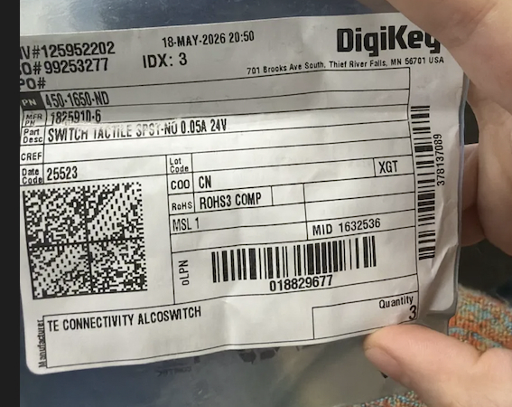 | Empty; TE/FSM1LP tactile in hand | Fit-check and solder |
| ECU ×1 | J3 SWD plus J4..J10 + unlabeled sensor headers | ECU bench photo + May 27 checklist | 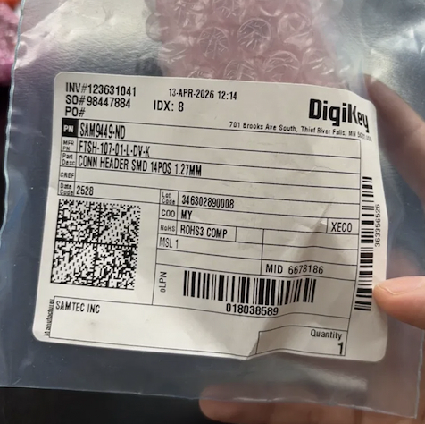 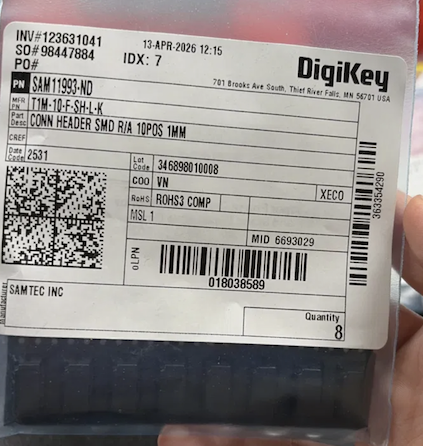 | Hand-populate headers; one FTSH short after ST-LINK adapter need | Populate ECU headers; buy one extra FTSH if no spare is found |
| ST-LINK adapter ×5 | HTSW J1 and FTSH J2 | May 27 checklist; no better adapter photo found here | 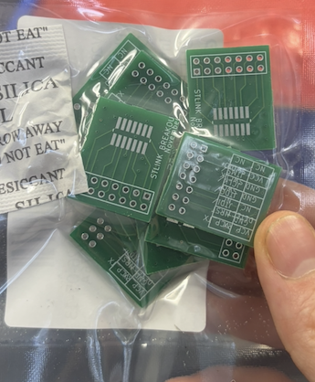  No saved HTSW image exists in the packet | Bare boards; HTSW missing and second FTSH short | Buy HTSW-107-07-G-D and one FTSH-107-01-L-DV-K |

### Part images for location-fill decisions

Use these saved packet images as the "what goes there" references for the location map above. Retake rows are intentionally omitted where the first selected image is clearer. A row marked "not in packet" needs procurement confirmation before the assembler can compare the physical part to the footprint.

| Location / decision | Part image | Fit / use note |
|---|---|---|
| Sensor module J1, bottom-edge 1 mm connector |  | Stocked quantity is five; buy three more before completing all eight sensors. |
| ECU U3 regulator |  | Fit-check TO-263 footprint, then prove the 3.3 V rail before downstream population. |
| ECU J2 USB Mini-B |  | Solder only after footprint/orientation check; exit proof is +5 V and USB enumeration. |
| ECU SW1 reset tactile |  | Footprint fit is an open hold; do not force-place if the switch body or pins do not match. |
| ECU sensor-group / bus headers |  | Populate only the headers required by the channel/cable map, then produce mux truth-table evidence. |
| ECU TMUX inspection / possible replacement | 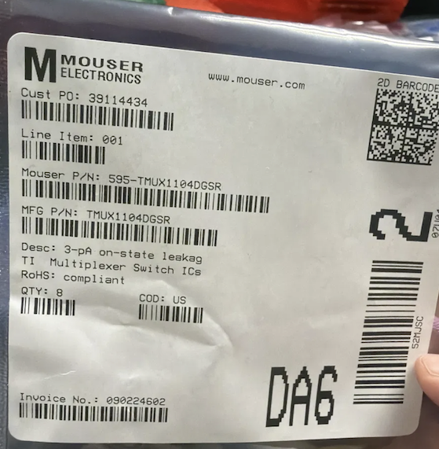 | Verify existing TMUX population before using the stock; stock is evidence, not an automatic place order. |
| ST-LINK adapter FTSH J2 and ECU J3/SWD path |  | One extra FTSH is needed if no spare is found after adapter and ECU allocation. |
| ST-LINK adapter HTSW J1 | not in saved packet | Buy HTSW-107-07-G-D and inspect against the bare adapter boards before claiming flash-path readiness. |

## 4. bci.place-furnished material

All boards, components, headers, cables, and the cap are bci.place-furnished; the assembler quotes labor only. Known shortfalls at issue date (cross-referenced as holds B1–B4 in §9) — to be verified & let Yuliya know if actually missing:

| Area | Stock / evidence | Action gate |
|---|---|---|
| Sensor boards | 8 boards; T1M-06 ×5; C3/R1/R2 stock | Need 8 J1 total (B1); probe-verify C3/R1/R2 before hand-add |
| ECU power/USB | LM1085 ×2; Mini-B ×2; tactile ×3 | Fit-check SW1 (B2); prove U3 rail and J2 enumeration |
| ECU mux/bus | T1M-10 ×8; TMUX1104 ×8; FTSH ×1 | Inspect mux population (B3); populate headers; map channel order |
| ST-LINK adapter | 5 bare boards; HTSW missing; extra FTSH needed | Procure/populate adapter headers (B4) before flash path is "ready" |
| Set aside | AD8618ARUZ, 1N5819W, S1SS mates, unmatched E4F | **Do not place without exact footprint/designator match** |

No substitutions of bci.place-furnished material without written bci.place approval.

## 5. Workmanship & handling standards

- Hand-solder acceptance to **IPC-A-610 Class 2**.
- ESD handling per ANSI/ESD S20.20 practice throughout.
- bci.place can provide a working station at MOX, 1618 Mission Street, San Francisco, with a fan, air filter, soldering bench, and ESD wrist straps. The assembler may use their own qualified station instead.
- First power-on of each board behind a current limit; no rework on powered boards.
- Defective or damaged CFM: stop work on that item, photograph, report per §9 non-conformance. Do not rework existing factory SMT population without written go-ahead.

## 6. Work items (mapped to spec states N1–N12)

Each work item states tasks and an **exit proof**; exit-proof artifacts are deliverables and feed the WI-9 evidence bundle. Quote each WI as a separate line in §7 quotation table.

### WI-1 — Inventory & kitting (N1) — qty 1 kit
- Count and map against the kit: 8 sensor boards, 1 ECU, 5 adapter boards, all headers, muxes, USB connector, regulator, switch.
- Produce a population map recording each board's as-received state (§3). Missing/unpopulated positions are tracked as build state, not footnotes.
- **Exit proof:** population map + shortfall list, signed.

### WI-2 — Sensor module hand-assembly (N2–N3) — qty 8 boards
- Hand-solder per board: **J1** (Samtec T1M-06-F-SH-L-K, bottom-edge 6-pad).
- **Probe-verify R1 / R2 / C1 / C2 / C3 / D1 / D2 before hand-add**. R1 and R2 are the only planned passive backups; C3 is shown as placed in the May 27 checklist but still gets value verification.
- **Do not place AD8618ARUZ at U1.** Current canonical source says sensor U1 is AD8616 SOIC-8 and is already placed by JLC; AD8618ARUZ is set-aside spare stock.
- **Exit proof:** per-board dark/light analog response log + photo.
- ⚠ Hold **B1**: only 5 of 8 J1 connectors stocked — completion capped at 5 boards until parts arrive.

### WI-3 — ECU assembly & power-up (N4–N6) — qty 1
Ordered steps:
1. Footprint fit-check **SW1** (hold **B2**).
2. Fit **U3** (LM1085), **J2** (USB Mini-B), **SW1**.
3. Prove the 3.3 V rail and J2 USB enumeration **before** further population.
4. Place **8× T1M-10 headers**.
5. Inspect **TMUX1104 ×8** population (hold **B3**).
6. Map mux select lines to channel order.
- **Exit proof:** rail measurement, USB enumeration evidence, mux truth table + ADC response per channel.

### WI-4 — ST-LINK adapter population (N5) — qty 5
- Boards arrive **bare**. Populate **HTSW J1** and **second FTSH J2** headers.
- ⚠ Hold **B4**: HTSW missing, extra FTSH needed — flash path is not "ready" until procured.
- **Exit proof:** 5 populated adapters, continuity-checked.

### WI-5 — Firmware flash (N5) — qty 1
- Flash STM32L476 via SWD through the ST-LINK adapter (ECU J3 = reserved FTSH). bci.place supplies firmware image + expected hash.
- **Exit proof:** flash log with hash readback; fresh flash with no improvised wiring.

### WI-6 — Emitter & detector bring-up (N7–N8) — qty 1 unit
- STM32 timers / GPIO expander sequence 660/940 nm LEDs on the selected module; photodiode/TIA returns analog through the connector to the ECU ADC (DMA).
- **Exit proofs:** LED current/optical within bound; non-saturated ADC samples.

### WI-7 — USB CDC framing (N9) — qty 1 unit
- Frame {channel, wavelength, timing, ADC values} to the host.
- **Exit proof:** serial frame log. Frame contract must match the channel/wavelength/cap map.

### WI-8 — Cap & cable integration + safety (N11) — qty 1 unit
- Cable mates, strain relief, **optode spacing (35 mm source–detector)**, skin-contact surfaces, shielding, USB isolation.
- **Exit proof:** completed safety checklist. Bench-safe ≠ body-safe — no human subject in this scope.

### WI-9 — Release QA / evidence bundle (N12) — qty 1
- Compile: 8 sensor photos, ECU photo, adapter photo, BOM counts, firmware hash, channel map, and rail/optical/USB/host evidence.
- **Exit proof:** evidence bundle delivered. This is the reproducibility gate and the release sign-off input.

## 7. Quotation summary (assembler to complete)

| WI | Description | Qty | Est. hours | Price |
|---|---|---|---|---|
| WI-1 | Inventory & kitting | 1 kit | | |
| WI-2 | Sensor module hand-assembly | 8 | | |
| WI-3 | ECU assembly & power-up | 1 | | |
| WI-4 | ST-LINK adapter population | 5 | | |
| WI-5 | Firmware flash | 1 | | |
| WI-6 | Emitter & detector bring-up | 1 | | |
| WI-7 | USB CDC framing | 1 | | |
| WI-8 | Cap & cable integration + safety | 1 | | |
| WI-9 | Release QA / evidence bundle | 1 | | |
| | **Total** | | | |

Lead time from kit-complete: ___ working days. Quote validity: ___ days.

## 8. Acceptance criteria (proof checklist)

| Claim | Evidence required | Rollback if missing |
|---|---|---|
| Board stack complete | 8 sensor photos, ECU photo, adapter photo, BOM counts | Return to N1/N2/N5 |
| Electrical acquisition | 3.3 V rail, reset, mux truth table, ADC dark/light samples | Return to N4/N6/N8 |
| Optical fNIRS timing | 660/940 nm current + optical bounds + frame timing | Return to N7/N9 |
| Host validity | USB frame log + bci.place-provided host ingest/plots/CSV with channel, wavelength, and cap-position labels matching the hardware map | Return to N9/N10 and rerun host validation |

Acceptance = bci.place review of the WI-9 evidence bundle within 5 working days of delivery.

## 9. Open blockers / holds (resolve at kickoff)

| ID | Blocker | Blocks | Owner | Action |
|---|---|---|---|---|
| B1 | Sensor J1: 5 of 8 stocked | WI-2 (3 of 8 boards) | bci.place | Procure 3× T1M-06-F-SH-L-K |
| B2 | SW1 footprint fit unknown | WI-3 | Assembler, at kickoff | Fit-check before placement |
| B3 | TMUX1104 population unverified | WI-3 | Assembler, at kickoff | Inspect/confirm ×8 |
| B4 | Adapter HTSW missing; extra FTSH needed | WI-4 → WI-5 | bci.place | Procure headers before flash path is "ready" |

**Non-conformance:** any failed exit proof or damaged CFM is reported with photos within 1 working day; the rework path is agreed in writing before proceeding.

### 9.1 Tree/history reconciliation

| Older claim or artifact | Current canonical resolution |
|---|---|
| `bcf-0036.tree` / earlier lists: sensor U1 as AD8618ARUZ hand-solder work | Superseded by May 27/28 evidence. Current sensor U1 is AD8616 SOIC-8, placed by JLC. AD8618ARUZ has no current designator and stays spare. |
| May 7 purchase matrix: ECU U3 as AMS1117-3.3 SOT-223 | Superseded by the fresh May 28 source pull and May 27 checklist. ECU U3 is LM1085ISX-3.3/NOPB TO-263; LM1085 stock is canonical. |
| May 7 purchase matrix: sensor D2/D3 and ECU D2 shortage risk | Later Y8 proof separates these: sensor D2 is VBPW34S on top, sensor D3 is 0603 green LED on bottom, ECU D2 is a USB TVS. Do not conflate the three. |
| May 7 purchase matrix: MMG3014 short for Uncut Gem | Later parts triage closed this: MMG3014 count became 8 in hand, enough for the three Uncut Gem boards' U2/U3 population if needed. |
| Earlier BOOBRIE SMA stock assumption | Superseded for Uncut Gem edge footprints: BOOBRIE through-hole SMA does not fit J1-J4 edge-mount footprints; use/verify Molex 73251-2120 style edge-mount for J1 RFIN. |

## 10. bci.place-side software boundary

The assembler does not develop the Python ingest, MBLL/CBSI, plotting, or multiplayer/cognitive inference software. The assembled unit is still a whole OpenFNIRS unit: release evidence must include a USB CDC frame log and a run of bci.place-provided host ingest/plots/CSV whose labels match the channel, wavelength, and cap map. No human-subject operation is under this bill of work.

## 11. Packaging & return

Finished assemblies returned in ESD packaging (original trays where available) with the digital WI-9 evidence bundle and the signed §7/§8 tables.

---
*Derived from the `openfnirs-state-machine` device spec (states N0–N12). Companion to the device spec at bci.place.*
