# Bill of Work — Uncut Gem NV Diamond Magnetometer Assembly & Bench Bring-Up

| | |
|---|---|
| **Document** | BOW-UCG-2026-001, Rev B (2026-06-10) |
| **Device ref** | Quantum Village Uncut Gem — current "Uncut Gem" KiCad main PCB |
| **Governing spec** | `uncut-gems-state-machine` (worlds session, 2026-06-02) — build states B0–B9 — assembly grounded in the repo BuildGuide + DiamondMount |
| **Status** | Issued for quotation |
| **Quote basis** | Fixed price per work item WI-1…WI-11 — quotation table in §8 |

## 1. Scope

Turnkey **assembly + bench bring-up of one (1) Uncut Gem NV magnetometer unit**.

**In scope:** incoming board inspection; hand-solder of the called-out parts; header/connector population; firmware flash; **the epoxy diamond-prism sub-assembly** (mould, embed diamond + microwave aerial + photodiode + filter, UV-cure); **laser module assembly**; staged bring-up (power → controller → PLL → RF → optomechanics → detector → trace) to the proof gates (§9), including the **INA333 acquisition-isolation rework** (§9, KI-1).
**Not in scope:** bare-PCB fabrication and factory SMT (procured separately); **NV-diamond sourcing/certification** (bulk from Element Six / Adamas Nano); the physics-grade optical calibration science; host-side trace analysis. Eye-safe **laser** and **RF** handling apply throughout — see §6.

## 2. Build quantities (one unit, "fixed-board model")

| Assembly | Qty | Notes |
|---|---|---|
| Uncut Gem main PCB | 1 | SMT-populated; hand-finish per §7 |
| Epoxy diamond prism (sub-assembly) | 1 | built per WI-6 from the parts below |
| — NV diamond (~750 µm) | 1 | purple, N-vacancy; bulk-sourced (CFM) |
| — Clear UV-cured epoxy + 10–20 mm silicone mould | 1 set | jewellery-grade |
| — 24 AWG enamelled copper wire | — | microwave aerial loop + structural |
| — BPW34 photodiode (3×3 mm) | 1 | placed directly below the diamond |
| — Red gel light filter | 1 | passes ~620 nm fluorescence |
| 520 nm green laser module | 1 | wired to 5V/GND (polarity-critical) |
| INA333 rework daughterboard | 1 | manual optimization (KI-1) |
| External 40 dB RF amp module (30–4000 MHz) | 1 | off-board, per buy-list |
| 1.3" OLED (SH1106 I²C) | 1 | status display |

Procurement context: parts were bought in a ×3 batch (`BOM-3x.md`); this BOW covers one assembled unit.

## 3. Board as received (mixed assembly state)

| Item | As-received | Assembler adds |
|---|---|---|
| Main PCB | **SMT-populated** — U7 ESP32-WROOM-32E, U1 ADF4351, U8 CP2102N, U5 TL082, U6 LM1117-3.3, X1 10 MHz, RF/analog passives | TH headers, SMA connectors, test points; verify populated parts |
| Headers/connectors | not fitted | 5V_SUPP1 (2×3), OLED1 (1×4), SPI1 (1×4), PHOTODIODE1 (1×3 socket), TP1/TP2, SMA J1–J4/J6 |
| Diamond prism | **not built** | full sub-assembly per WI-6 |
| Laser module | loose | mount + wire per WI-6 |
| INA333 daughterboard | bare / not built | build + integrate per KI-1 |

### Reference photos — current PCB, unfilled locations, and rework issue

**Main PCB (Uncut Gem / Quantum Village / DEF CON 33):** current clear photo of the bci.place-furnished board. Use it for board identity, connector-pad orientation, unfilled-footprint inspection, and incoming-condition reference only; it does not prove RF, optical, detector, ADC, or ODMR bring-up.

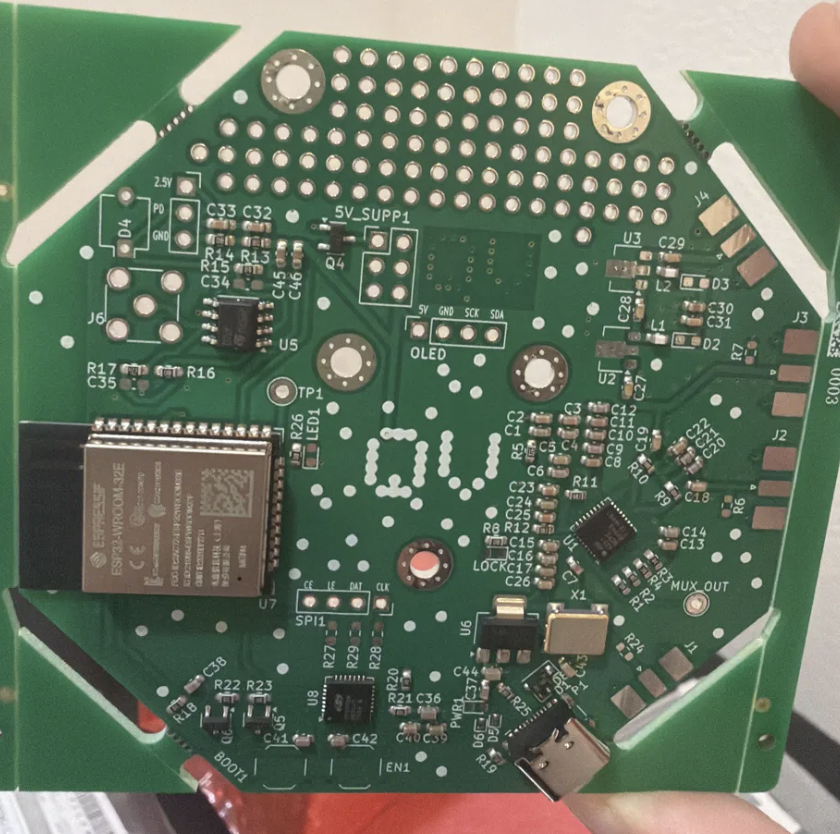

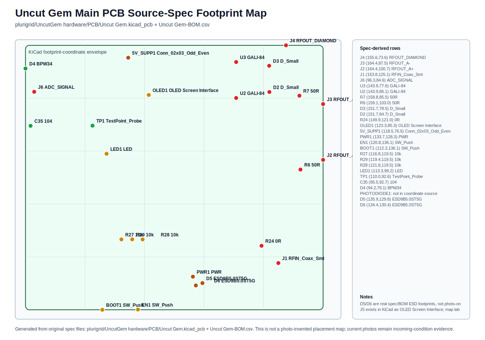

**Current kitting and handling images:** use the enclosure/tooling photo for return custody and the MSL3 bag photo for handling discipline. Legacy renders and older device photos are audit context only, not assembler-facing instructions for this current board.

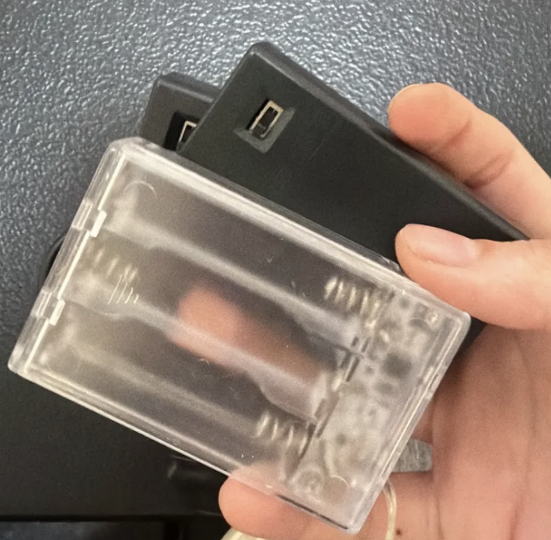

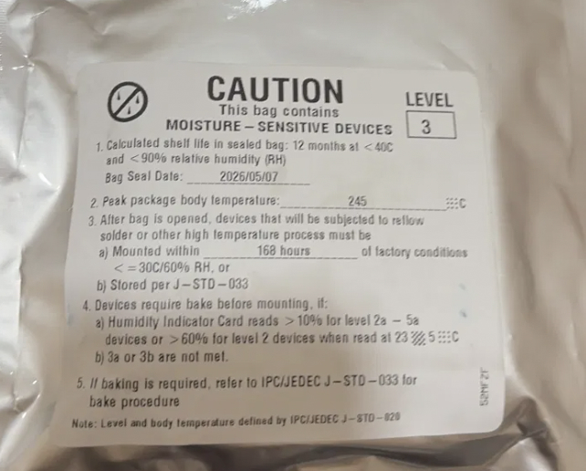

**Current electronic issue:** analog measurement integrity is the rework target. RF/modulation energy can couple into the detector-to-ADC path and make ODMR dips ambiguous. Capture stock dark, light, RF-off, RF-on, and sweep baselines before any rework; install the INA333 daughterboard only as a reversible improvement if the baseline confirms the issue.

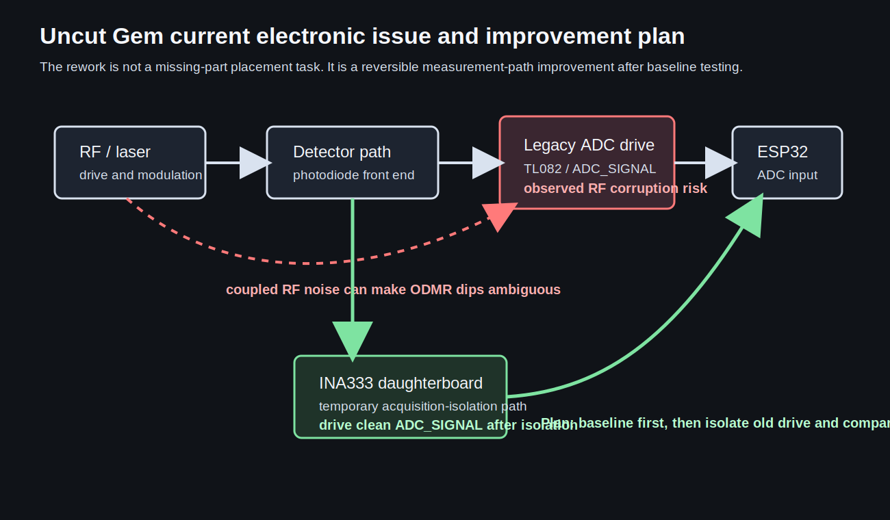

Repo DiamondMount assembly spec evidence is used only with current kit evidence for the prism, laser, and optical-mechanical work items below.

### Visual location map — missing, verify-only, and indeterminate work

| Assembly | Location | Board image evidence | Part image / part-evidence image | Current status | Action |
|---|---|---|---|---|---|
| Main PCB | J1 RFIN, right-edge SMA edge-mount footprint | Current board photo + unfilled-location diagram | No saved image of the required Molex 73251-2120 style edge-mount SMA exists in the packet. The saved BOOBRIE vertical SMA image is caution evidence only and must not be treated as the fill part. | Required RF input connector; BOOBRIE through-hole stock does not prove fit for the edge footprint | Verify any existing SMA fit; otherwise source/photograph the correct Molex 73251-2120 style edge-mount before install |
| Main PCB | J2/J3/J4 RFOUT_A+/A-/DIAMOND, right-edge SMA edge footprints | Current board photo + unfilled-location diagram | No fill image needed unless bci.place turns these DNP/optional footprints into populate-now work; if populated, use the same exact edge-mount SMA evidence as J1 | Optional/DNP in current checklist | Leave unpopulated unless bci.place issues a board-specific RF-output request |
| Main PCB | J6 ADC_SIGNAL SMA | Current board photo + INA333 rework plan | No fill image needed unless the rework plan requires this connector; if populated, use exact edge-mount SMA evidence, not BOOBRIE vertical SMA | Optional/DNP; relevant to ADC_SIGNAL probing/rework | Do not force-populate; use only if the INA333 rework plan requires it |
| Main PCB | OLED1 top/center 4-pin header | Current board photo + unfilled-location diagram | 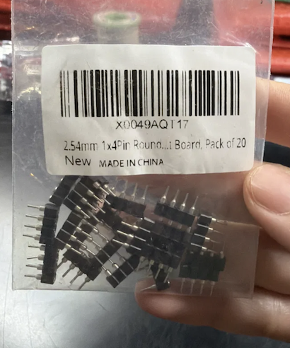 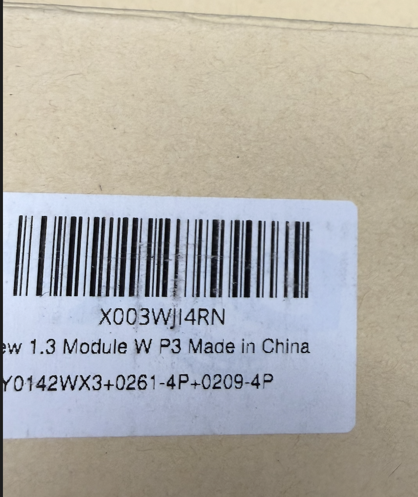 | Header not fitted; 1×4 header stock in hand | Populate only if the current test/display plan requires it; verify VDD/GND/SCK/SDA order before power |
| Main PCB | SPI1 lower-center 4-pin header | Current board photo + unfilled-location diagram |  | Header not fitted; 1×4 header stock in hand | Populate for firmware/debug access only if required |
| Main PCB | 5V_SUPP1 upper-mid 2×3 power header | Current board photo + unfilled-location diagram | 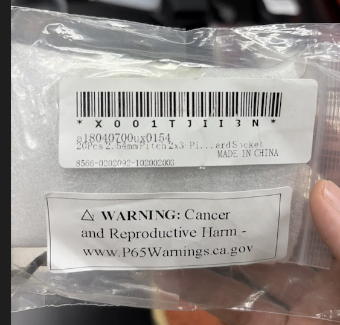 | Header not fitted; 2×3 stock in hand | Populate only if the current power plan requires this header, then prove protected 5 V / 3.3 V rails |
| Main PCB | PHOTODIODE1 1×3 detector socket | Current board photo + detector wiring plan | 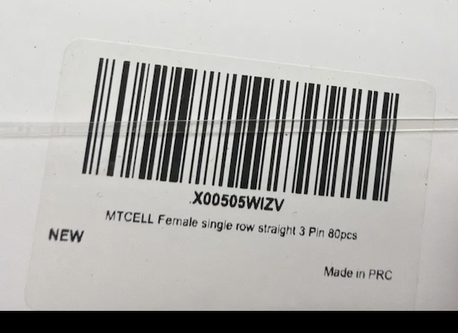 | Socket not fitted; MTCELL 1×3 socket stock in hand | Populate only when the selected detector assembly requires it and pinout is verified |
| Main PCB | U2/U3 MMG3014 RF amp positions | Current board photo + May 27 checklist | 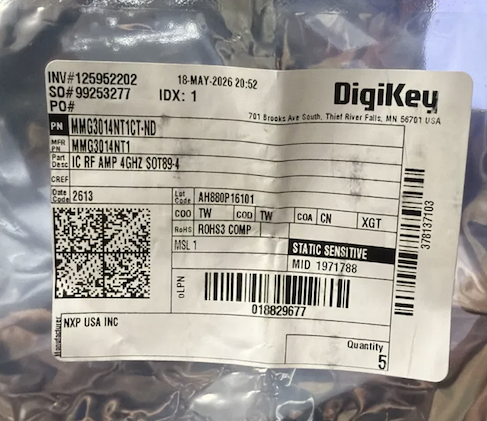 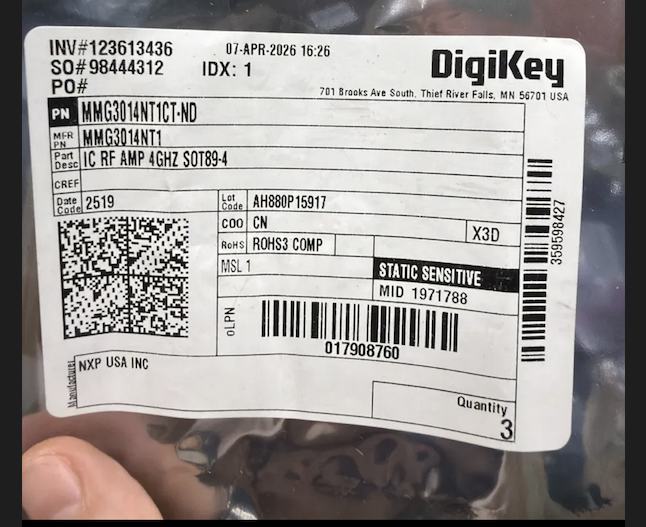 | MMG3014 buy is closed with 8 in hand; inspect board before claiming population | No new buy; populate only if actual board inspection shows empty U2/U3 |
| Prism subassembly | Diamond, BPW34, red gel, aerial loop, epoxy layers | Repo DiamondMount assembly spec + current kit evidence | 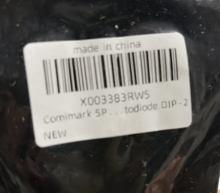 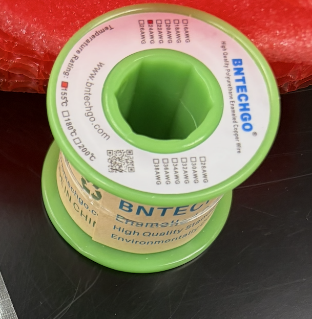 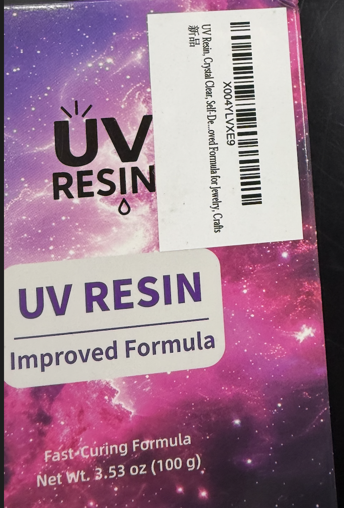 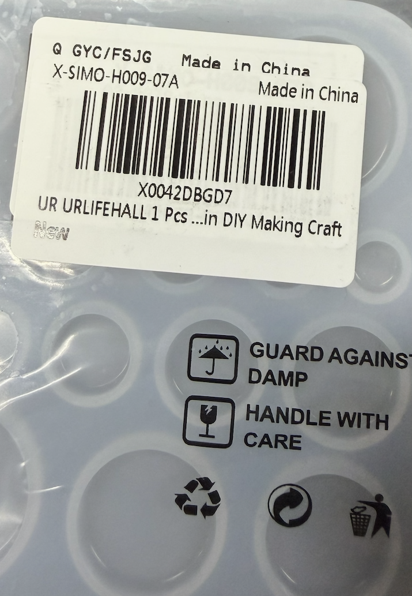 No saved diamond image exists in the packet | Not a PCB populate step; this is the major hand-built optical/mechanical assembly | Build per WI-6; photograph every layer before cure |
| Laser module | 520 nm laser aligned into diamond/prism | Current kit evidence + WI-6 alignment proof | 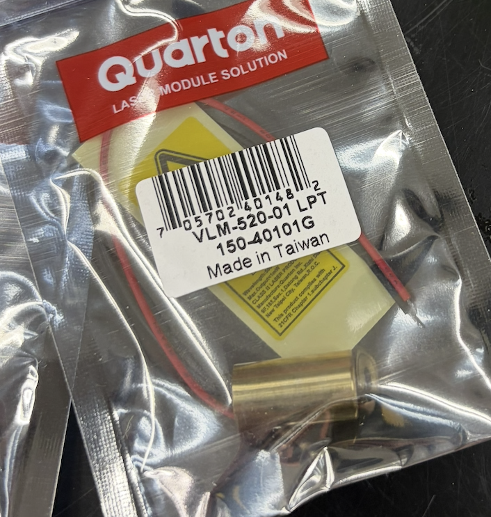 | Loose module in kit; polarity-critical | Mount, wire to 5V/GND, verify eye-safety controls |
| INA333 rework | Off-board ADC_SIGNAL isolation daughterboard | No shipped-PCB location; tied to U5/J6/TP nodes | No saved INA333 part image exists in the packet; the generated rework diagram remains the current visual instruction until the daughterboard parts are photographed | New work, not present on shipped board | Build only as KI-1, compare baseline before/after, keep reversible |

### Part images for location-fill decisions

Use these saved packet images as the "what goes there" references for the location map above. Correct-fit uncertainty is preserved in the notes; the part image is not permission to solder unless the footprint, orientation, pinout, and current board need all agree.

| Location / decision | Part image | Fit / use note |
|---|---|---|
| J1 RFIN edge SMA | 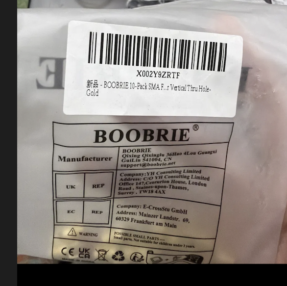 | This saved part is the wrong through-hole style for the edge footprint; use it as a no-substitution warning, not as the target part. Correct Molex 73251-2120 style evidence is not in the saved packet. |
| OLED1 1×4 header |  | Populate only if the current display/test plan requires OLED1 and pin order is verified. |
| SPI1 1×4 header |  | Populate only if required for firmware/debug/peripheral access. |
| 5V_SUPP1 2×3 power header |  | Populate only if the selected power plan uses this header, then prove protected 5 V and 3.3 V rails. |
| PHOTODIODE1 detector socket |  | Populate only when the detector assembly pinout is verified. |
| U2/U3 MMG3014 RF amp check |  | Stock count closes the purchase concern; microscope inspection determines whether any board placement is actually needed. |
| Prism BPW34 detector |  | Place in the prism assembly below the diamond, not as an OpenFNIRS sensor substitute. |
| Prism microwave aerial |  | Form the aerial loop around the diamond during the epoxy-layer build. |
| Prism mould / epoxy body |  | Verify size and cleanliness before cure; photograph every layer before the next pour. |
| Prism clear resin |  | Use only under the ventilation and handling controls in §5. |
| 520 nm laser module |  | Polarity-critical; mount and wire only after eye-safety controls are ready. |
| OLED module candidate |  | Treat as candidate display evidence; verify interface/pinout before connecting to OLED1. |

## 4. bci.place-furnished material

All boards, modules, the diamond, laser, wire, epoxy, antenna, and connectors are bci.place-furnished; the assembler quotes labor only. Key parts (PCB from `hardware/PCB/JLCPCB-BOM.csv`; prism from `hardware/DiamondMount`):

| Function | Designator / part | Note |
|---|---|---|
| RF connectors | **Molex 73251-2120 SMA edge-mount** — J1 RFIN, J2/J3 RFOUT_A±, J4 RFOUT_DIAMOND, J6 ADC_SIGNAL | **verify on board (§9, V-1)** |
| PLL / synth | U1 ADF4351 (LFCSP-32), X1 10 MHz | microwave source |
| RF gain | external 40 dB module + on-board L1/L2 470 nH, R9/R10 50 Ω | inspect/integrate (V-2) |
| Controller | U7 ESP32-WROOM-32E, U8 CP2102N, OLED1 | firmware coordinator |
| Power | P1 USB-C, U6 LM1117-3.3, 5V_SUPP1 | rails; isolated USB recommended |
| Diamond prism | NV diamond, UV epoxy + mould, 24 AWG aerial, BPW34, red gel | the optical heart (WI-6) |
| Light source | 520 nm laser module | polarity-critical |
| Front-end | U5 TL082, TP1, TP2/MUX_OUT | conditioning |
| Rework | INA333 (off-BOM daughterboard) | KI-1 |

No substitutions of CFM parts without written approval.

## 5. Workmanship & handling standards

- Hand-solder acceptance to **IPC-A-610 Class 2**; ESD handling per ANSI/ESD S20.20.
- bci.place can provide a working station at MOX, 1618 Mission Street, San Francisco, with a fan, air filter, soldering bench, and ESD wrist straps. The assembler may use their own qualified station instead.
- First power-on behind a current limit; **isolated/protected USB** for test (per BuildGuide); **laser and RF stay OFF until their stage** (B0 safety).
- Eye safety for the 520 nm laser and RF-exposure care are gating, not optional.
- Diamond prism: UV-cure in a ventilated area; the ~750 µm diamond is a single bulk-sourced grain — handle/track as a high-value small part.
- Defective/damaged CFM: stop, photograph, report per §9 non-conformance; do not rework factory SMT population without written go-ahead.

## 6. Work items (mapped to spec states B0–B9)

Each WI carries an **exit proof**; proofs are deliverables feeding the WI-11 evidence bundle. Quote each WI as a line in §8.

### WI-1 — Inventory & kitting (B0) — qty 1 kit
- Map kit against BOM + DiamondMount parts; record as-received population (§3). Confirm laser/RF OFF and 5 V untrusted until proven.
- **Exit proof:** population map + shortfall list, signed; "no powered emission" state.

### WI-2 — Power rails (B1) — qty 1
- Fit P1 (USB-C) / 5V_SUPP1; prove protection and U6 LM1117 3.3 V before any downstream load. Check R1/R2 divider (5 V / 2.5 V / 0 V) per BuildGuide.
- **Exit proof:** 5 V and 3.3 V measured.

### WI-3 — Controller bring-up (B2) — qty 1
- Populate OLED1 header, ESP32/ADF4351 sockets (ADF4351 socket solders on the **back**), BOOT1/EN1; CP2102N (U8) programs ESP32 (U7); OLED + serial report state. Flash firmware.
- **Exit proof:** boot log + OLED alive.

### WI-4 — PLL / microwave source (B3) — qty 1
- X1 10 MHz drives U1 ADF4351; ESP32 writes SPI registers (SPI1); confirm `LOCK` LED and output (~2880 MHz per stock firmware modes).
- **Exit proof:** PLL lock + frequency as configured.

### WI-5 — RF gain & connectors (B4) — qty 1
- Mount ADF4351 (back) + RF amp board (front); link with a short SMA–SMA cable; **fit + verify the SMA connectors — use the existing one if it works (V-1)**; inspect L1/L2 / R9-R10 50 Ω matching; integrate external 40 dB amp; short test antenna to confirm.
- **Exit proof:** SMA fit + RF continuity + sane bias.

### WI-6 — Optomechanical assembly: diamond prism + laser (B5) — qty 1 — **major hand-assembly**
- **Diamond prism (jewellery-style epoxy mount):** in a 10–20 mm silicone mould, layer clear UV-cured epoxy; form a small loop of 24 AWG enamelled-copper microwave aerial and place it **around the ~750 µm NV diamond** during layering; seat the **BPW34 photodiode directly below and close to** the diamond; add the **red gel filter**; UV-cure. Result: the "diamond holding prism" with aerial + photodiode leads.
- **Laser:** mount the 520 nm green laser module; wire to the 5V/GND socket **watching polarity**.
- **Co-locate** laser spot, diamond prism, and microwave aerial in the printed holder.
- **Exit proof:** cured prism (diamond + aerial loop + BPW34 + gel), laser mounted, visible green-on-diamond alignment.

### WI-7 — Detector path (B6) — qty 1
- Connect the assembled prism's **BPW34 leads to the PHOTODIODE1 (1×3) socket**; verify the D4 path converts red (~620 nm) fluorescence to current.
- **Exit proof:** dark/light contrast at the detector.

### WI-8 — Front-end / ADC (B7) — qty 1
- U5 TL082 conditions detector current (add C1/C2 only if using the op-amp as an integrator); ADC_SIGNAL reaches ESP32 and TP1 / TP2 (MUX_OUT).
- **Exit proof:** unsaturated baseline.

### WI-9 — Sweep QA (B8) — qty 1
- ESP32 sweeps 128 points, averages ADC, streams the trace.
- **Exit proof:** repeatable ODMR dip candidate (baseline + dip + recorded settings).

### WI-10 — Build the INA333 acquisition-isolation daughterboard (B9) — qty 1 — **KNOWN-ISSUE / MANUAL OPTIMIZATION (KI-1)**
- **This is new work, not a populate step.** The INA333 daughterboard is **not on the Uncut Gem PCB as shipped** — the assembler fabricates/builds it from scratch (INA333 instrumentation amp + headers/probes, off-BOM).
- **The error being fixed:** on the main board, RF energy couples into the detector / `ADC_SIGNAL` line, corrupting the analog baseline so ODMR dips are noisy or ambiguous. This is the designer's known defect — the board ships needing it corrected.
- **The fix:** route the detector-side input into the **INA333** and have it drive one clean, isolated single-ended `ADC_SIGNAL` to the ESP32. Map U5 / J6 / TP nodes; **isolate the old TL082 output before injecting the clean ADC drive.** Reversible — no re-spin of the main PCB.
- **Exit proof:** lower-noise acquisition with **no RF-sweep regression** (stock-vs-rework comparison).

### WI-11 — Release QA / evidence bundle — qty 1
- Compile: board photo, rail measurements, boot log, PLL/LOCK trace, RF continuity, prism + laser alignment photo, detector dark/light, ODMR sweep, INA333 before/after, firmware hash, BOM counts.
- **Exit proof:** evidence bundle delivered (reproducibility gate).

## 7. Quotation summary (assembler to complete)

| WI | Description | Qty | Est. hours | Price |
|---|---|---|---|---|
| WI-1 | Inventory & kitting | 1 | | |
| WI-2 | Power rails | 1 | | |
| WI-3 | Controller bring-up | 1 | | |
| WI-4 | PLL / microwave source | 1 | | |
| WI-5 | RF gain & connectors | 1 | | |
| WI-6 | Optomechanical assembly (prism + laser) | 1 | | |
| WI-7 | Detector path | 1 | | |
| WI-8 | Front-end / ADC | 1 | | |
| WI-9 | Sweep QA | 1 | | |
| WI-10 | Build INA333 isolation daughterboard (new) | 1 | | |
| WI-11 | Release QA / evidence bundle | 1 | | |
| | **Total** | | | |

Lead time from kit-complete: ___ working days. Quote validity: ___ days.

## 8. Acceptance criteria (spec proof checklist)

| Claim | Evidence required | Rollback if missing |
|---|---|---|
| Buildable | rail measurements, boot log, SMA-compatible connectors, RF passive inspection | Return to B0/B1/B4 |
| Microwave source | PLL/LOCK trace, output proof, RF continuity/bias | Return to B3/B4 |
| Optical coupling | prism photo, laser/diamond/aerial alignment + dark/light contrast | Return to B5/B6 |
| ODMR candidate | repeatable sweep with baseline, dip, recorded settings | Return to B7/B8 |
| INA333 improvement | stock-vs-rework noise comparison, unchanged RF sweep | Revert B9 |

## 9. Open items — known issue, verify-on-board, and holds

| ID | Type | Item | Action |
|---|---|---|---|
| **KI-1** | **Known issue (designer) — build a NEW rework board** | **The shipped PCB couples RF energy into the detector / `ADC_SIGNAL` path, corrupting the analog baseline** so ODMR dips are noisy/ambiguous | Build a **new INA333 daughterboard** (WI-10) — not present on the board as shipped — that drives one clean, isolated `ADC_SIGNAL` to the ESP32. The board ships needing this fix; it is the designer-flagged optimization, not a defect to reject |
| **V-1** | **Verify on board** | **SMA connectors (J1–J4, J6)** | Confirm the SMA fits and passes RF continuity — **use the existing/populated SMA if it works**; only swap to the **Molex 73251-2120 horizontal edge-mount** if it genuinely will not fit or fails continuity. Part/function check, **not** a footprint redesign |
| V-2 | Verify | RF amp population + external 40 dB module integration | Inspect bias/matching before any RF claim |
| V-3 | Verify | Prism geometry + detector baseline | Co-locate diamond/aerial/laser and prove detector baseline before interpreting any trace |

**Non-conformance:** any failed exit proof or damaged CFM is reported with photos within 1 working day; rework path agreed in writing before proceeding.

### 9.1 Tree/history reconciliation

| Older claim or artifact | Current canonical resolution |
|---|---|
| `bcf-0031.tree` and early order notes: BOOBRIE SMA stock could satisfy Uncut Gem SMA footprints | Superseded by May 27/28 fit-check: BOOBRIE through-hole SMA does not fit J1-J4 edge-mount footprints. J1 RFIN needs Molex 73251-2120 style edge-mount if no working populated connector exists. |
| Early purchase matrix: MMG3014 shortage | Later parts triage closed this line: 8× MMG3014 in hand covers U2/U3 across three boards. Inspect before solder; no new buy. |
| Early purchase guides: BPW34 as a generic photodiode purchase | Still valid for Uncut Gem prism/D4 detector work. It is not a replacement for OpenNIRScap sensor D2, which is VBPW34S SMD. |
| BuildGuide/purchase warning: RF amplifier mounts on back of PCB | Still active. Keep as an assembly warning and verify RF continuity/bias before RF claims. |
| INA333 acquisition isolation | Persisted as a known issue/manual optimization. It is not a missing shipped PCB part; it is a new reversible daughterboard build tied to ADC_SIGNAL cleanup. |

## 10. Out of scope for the assembler

NV-diamond sourcing/certification, physics-grade optical calibration science, host-side trace analysis/plotting, and any magnetometry-performance claims. No BCI claim — this is a laser + RF instrument.

## 11. Packaging & return

Finished unit returned in ESD packaging with laser/RF safed and the prism protected, plus the digital WI-11 evidence bundle and the signed §7/§8 tables.

---
*Derived from the `uncut-gems-state-machine` spec (states B0–B9), the real `Uncut Gem` hardware BOM (`u/UncutGem/hardware/PCB/JLCPCB-BOM.csv`), and the repo BuildGuide + `hardware/DiamondMount`. Companion to the openfnirs assembly BOW.*
