# Yoyo notes from nyc-neuromodec-2026

**Epistemic status:** Rearranged from raw notes from conference, may contain mistakes. Numerical quanities have not been independently fact checked. Contact Yoyo via yoyoyuan1729@gmail.com for any disputes or mistakes. Contributions from more experienced researchers are welcome.

[Select videos: unofficial recordings & unlisted](https://www.youtube.com/playlist?list=PLG21REer7mCI)

⭐️ denotes personal favourites:

* Nir Grossman AE talk
* Shan Siddiqi treating disorders talk
* Shadi Dayeh, argument for high-bandwidth BCIs

😉 denotes interesting

### Relating neuromodulation modalities

When the electric field is the primary physical input to tissue, we can arrange modalities on a 2d axis of E-field amplitude vs frequency. At higher frequencies and amplitudes, modalities could not be used due to causing too much pain to the scalp. from Angel Peterchev's talk.

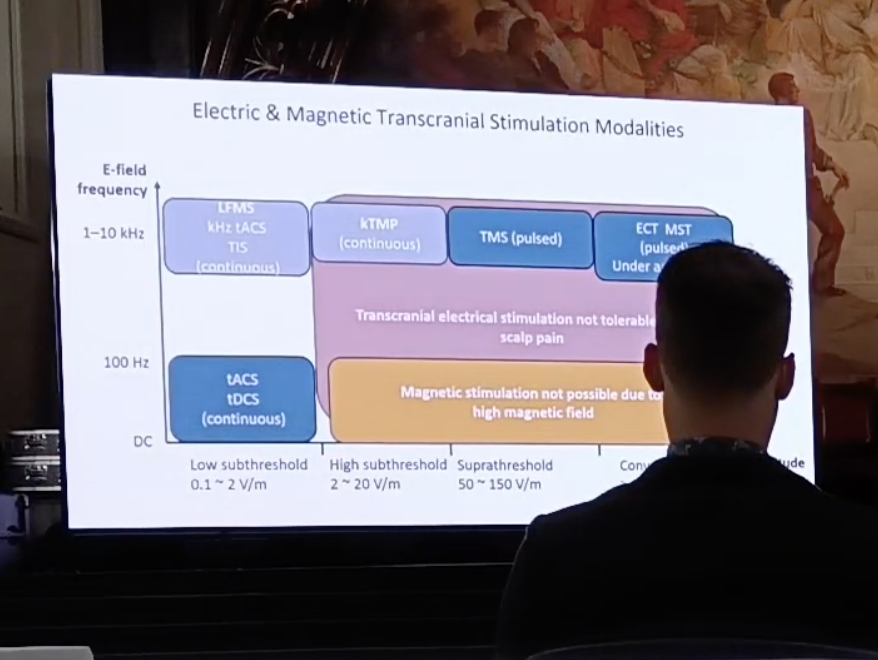

Ultrasound is not within this clasification system as it includes pressure waves. Neither is microwave/rf heating.

### Lazy use of the word "frequency":

Addressing confusion: How can ultrasound be at megahertz and still produce a small focal spot where as the microwave frequency is at Ghz and produces waves of thirty cm?

Ultrasound is an acoustic wave, travels in soft tissue with v = 1540 m/s. Thus by v = f * lambda:

| Ultrasound frequency | Wavelength |
| -------------------- | ---------- |
| 10 kHz               | 15.4 cm    |
| 100 kHz              | 1.54 cm    |
| 250 kHz              | 6.2 mm     |
| 500 kHz              | 3.1 mm     |
| 1 MHz                | 1.54 mm    |
| 5 MHz                | 0.31 mm    |
| 1 GHz                | 1.54 µm    |

The microwave travels through air.

| Frequency | Wavelength         |
| --------- | ------------------ |
| 1 kHz     | 300 km             |
| 10 kHz    | 30 km              |
| 100 kHz   | 3 km               |
| 1 MHz     | 300 m              |
| 10 MHz    | 30 m               |
| 100 MHz   | 3 m                |
| **1 GHz** | **0.30 m = 30 cm** |

In materials, waves travel more slowly, so their wavelengths are correspondingly shorter.

**Carrier frequency**: describes the lambda of the waveform applied to the tissue, e.g. tACS, perhaps 10 Hz, TI is at 2 kHz, ultrasound: several hundred kHz to MHz. Microwave stimulation is at 1 GHz.

**Pulse repetition frequency**: e.g. The same ultrasound wave could be delivered at 5 Hz, 50 Hz, 500 Hz etc.

**Envelope frequency**: In TI, two subthreshold waves combine additively into an above-threshold wave to produce a focal spot, see image:

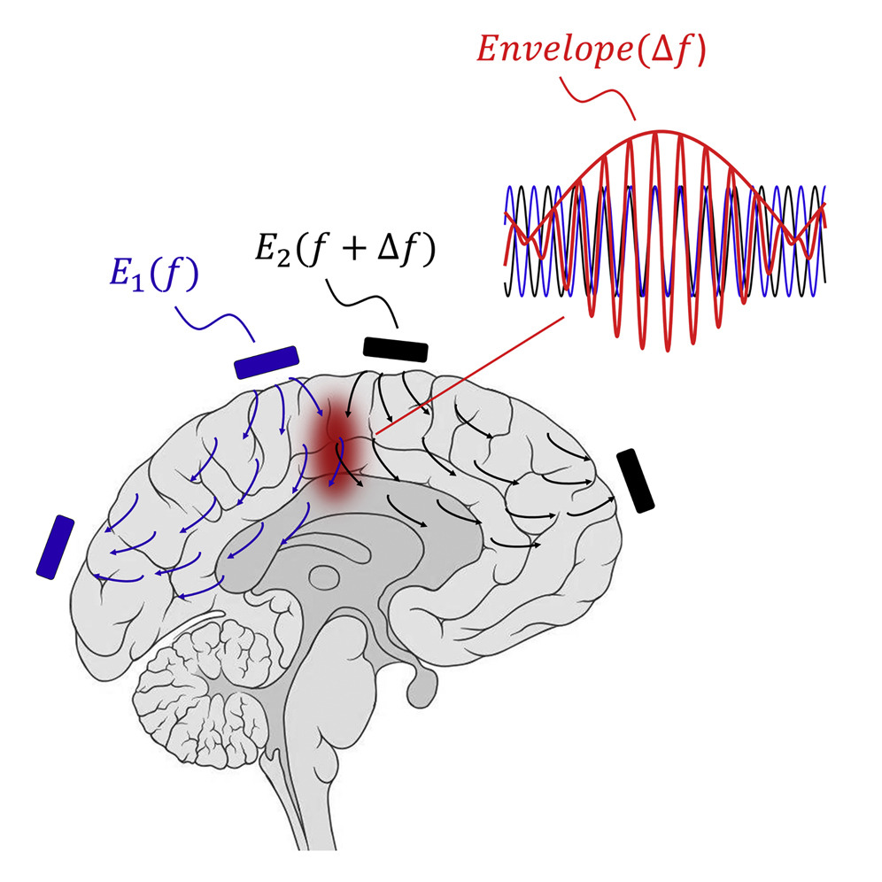

The slow modulation produced by combining or modulating carriers.
For two temporal-interference fields, $f_{\text{envelope}} = |f_1-f_2|$.
Suppose two electrodes generate a TI field at 2 kHz and 2.01 kHz. The envelope frequency is 10 Hz.

### Lazy use of the word "maximum"

It could refer to:

* an electric-field maximum,
* an envelope-modulation maximum,
* an acoustic-pressure focus,
* a SAR maximum,
* a temperature maximum,
* or a region of strongest biological response.
* The physically most focal region may not be the most functionally specific region because activity can propagate through networks.
* Applied current is not the same as intracranial electric field.
* Electric-field amplitude is not the same as current density.

From above diagram:

* **tDCS**. Primarily for polarization of resting membrane potential. Low amplitude (~0.1 - 2 V/m), DC (0 Hz). It is longer term than focused ultrasound. Lower current adjustments ~= higher spatial resolution.
* **tACS** For synchronization/entrainment of endogenous oscillations. **Low-Medium**, 1 Hz - 10 kHz. Can be used with phase shifts to create travelling waves.
* **Temporal Interference (TI)**: Low-Medium, Uses high kHz carrier frequencies to create a low-frequency envelope. Mechanism: Subthreshold, non-linear? or possibly additive mixing in neurons. Needs circuit-level synchronization
* **rTMS**: High (~100 V/m), ~1-20 Hz (repetition rate): Strong, but sensation and focality can be issues.
* **ECT**: Very High (~150 V/m+), ~1-100 Hz: Induces a seizure. The extreme end of the spectrum.
* **kHz TMS (kTMS)**: High, 1 kHz - 10 kHz (carrier frequency): Seeks to combine the strength of TMS with lower scalp sensation than rTMS (repetitive TMS). Stronger E-field than tACS/tDCS/TIS.

Two types of electrical stimulation

* Pulsing using square waves {amplitude, freq, N pulses, pulse width}
* Sinusoidal electrical stimulation

At low frequencies, geometry and conductivity matter. The electric field mechanisms are dominant. At high frequencies, the connectivity and synaptic density dominate. This agrees with the counterintuitive graph from Individual/Group optimization of tES poster.

### DBS Frequency Effects

* **50-100 Hz**: potentiates activity
* **200 Hz**: suppresses activity (rate-dependent depression; possible vesicle depletion)
* 6 months of DBS activation helps correct inhibition signals; matches inter-trial phase coherence

### Entrainment Factors

* **Low frequency**: geometry and conductance dominate; electric field mechanisms
* **High frequency**: connectivity dominates; synaptic mechanisms
* Using Allen Brain Connectivity Atlas

---

## 2. Electrical Stimulation

### Irene Rembado, PhD - *Frequency as a Mechanistic Switch: How Cortical Sinusoidal Electrical Stimulation Engages Neural Circuits* ([video](https://youtu.be/y6JbusWgBKc))

Two broad forms of electrical stimulation:

1. **Pulsed stimulation**
  * amplitude
  * frequency
  * number of pulses
  * pulse width
2. **Sinusoidal stimulation**
  * amplitude
  * carrier frequency
  * phase
  * duration

Recordings may include local field potentials.

### tDCS

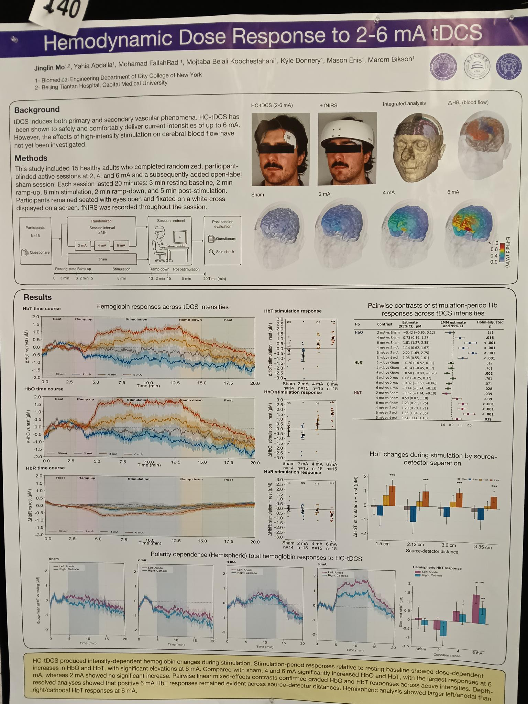

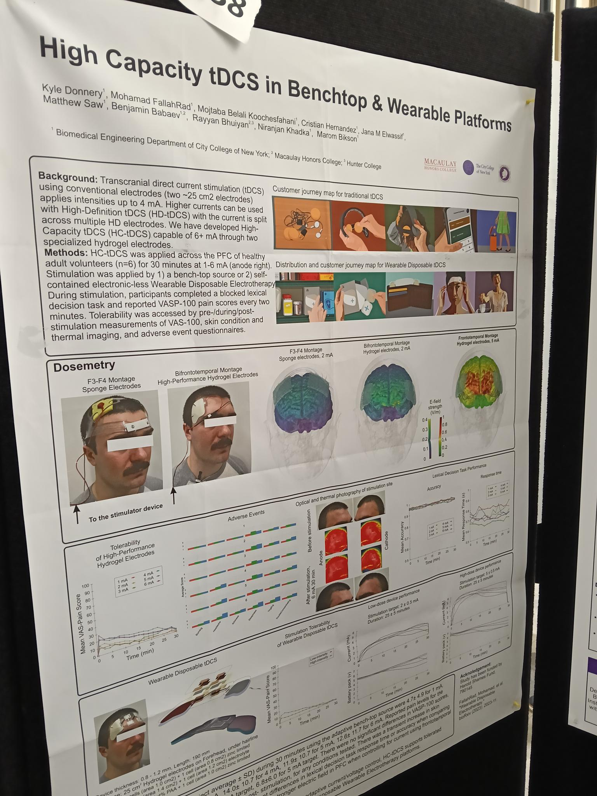

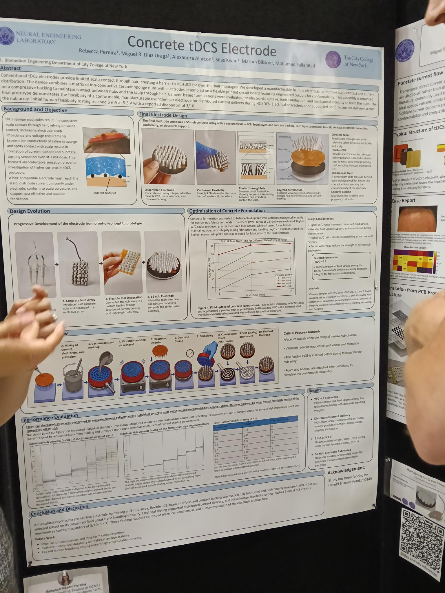

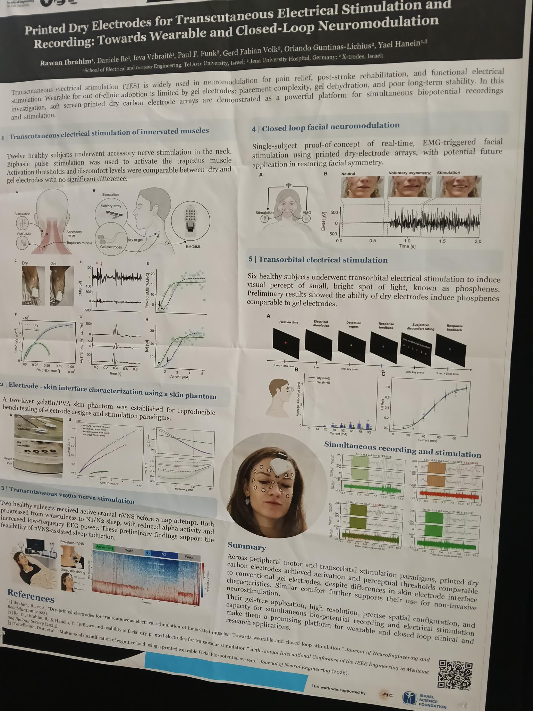

* Usually framed as producing polarization.
* Reported protocols included roughly **2–6 mA**.
* Some studies combined tDCS with EEG and TMS.
* In some cases, there was no effect on learning or memory.
* Long-term tDCS was discussed alongside short-term LIFU approaches to memory.
* Measures included:
  * ADAS-Cog,
  * attention inventories,
  * executive-function inventories,
  * caregiver distress,
  * and related clinical measures.
* Group and individualized tES optimization were presented.

NERNI poster:

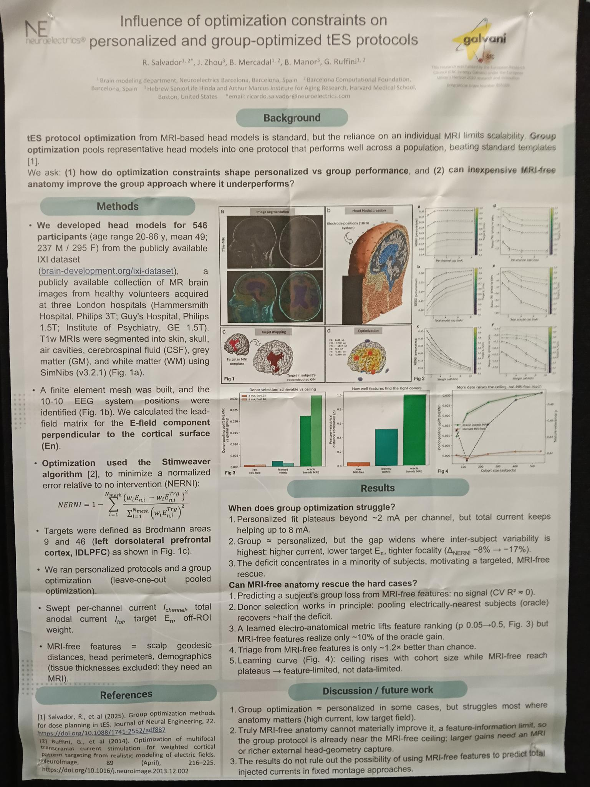

* study tries to calculate personalized optimal electric field. however not all studies have time to calculate optimal electric field, so you can do a group-scale optimization
* Left column: personalized NERNI. when the tES current increased in individual stimulation, the error reduced because more current can reach the optimal electric field
* Right column: group performance relative to personalized. More negative means the group solution falls further behind personalization. More current correlates with higher error
* low current delivery is more fine grained
* they used NERNI as the performance score (0 - 1), higher means more error and more difference between the ideal electric field and the actual electric field. See the [NERNI paper](https://pmc.ncbi.nlm.nih.gov/articles/PMC11956972/).

### tACS

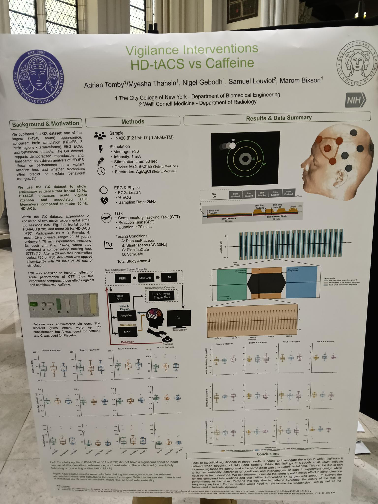

* Usually framed as producing synchronization/entrainment.
* Phase-shifted tACS can be used to create apparent traveling waves.
* Questions:
  * Is the intended target a local oscillator, a pathway, or a distributed phase gradient?
  * How should phase errors caused by anatomy be modeled?
  * How does low-frequency entrainment differ from network-mediated high-frequency effects?

The Allen Brain Connectivity Atlas was mentioned as a possible source for connectivity modeling.

Resource noted: [parralab.org](https://parralab.org)

### Amplitude versus current density

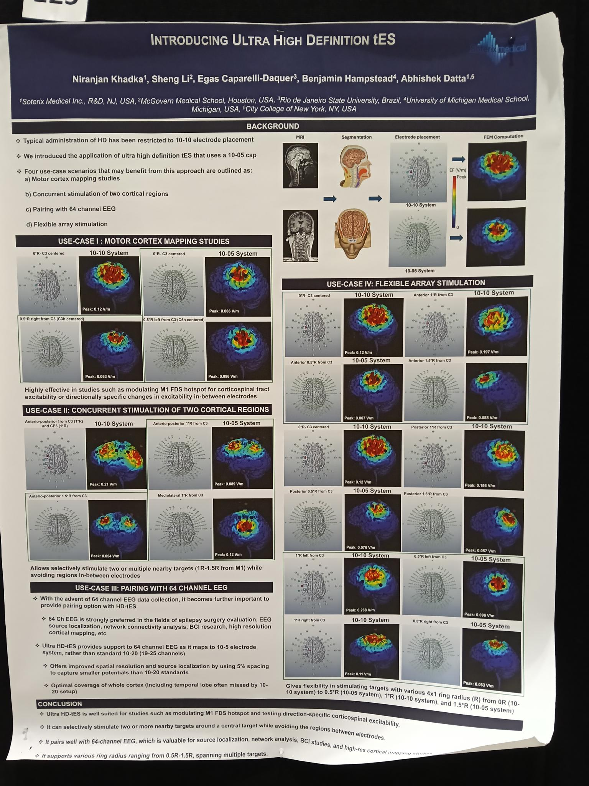

* A recurring concern was whether **current density** is more informative than total applied current or nominal amplitude.
* Increasing device current does not guarantee a proportional or spatially uniform increase at the target.
* Marketing claims often report the controllable device parameter rather than the actual intracranial dose.

---

## 3. Temporal Interference Stimulation

* Two or more higher-frequency electrical signals combine to produce a slower envelope.
* The stated objective is to preferentially stimulate a deeper region where the envelope modulation is strongest.
* Visualization methods included:
  * envelope-amplitude maps,
  * finite-element modeling.
* tDCS: polarization
* tACS: synchronization
* TI: may require synchronization or nonlinear interaction at the **circuit level**

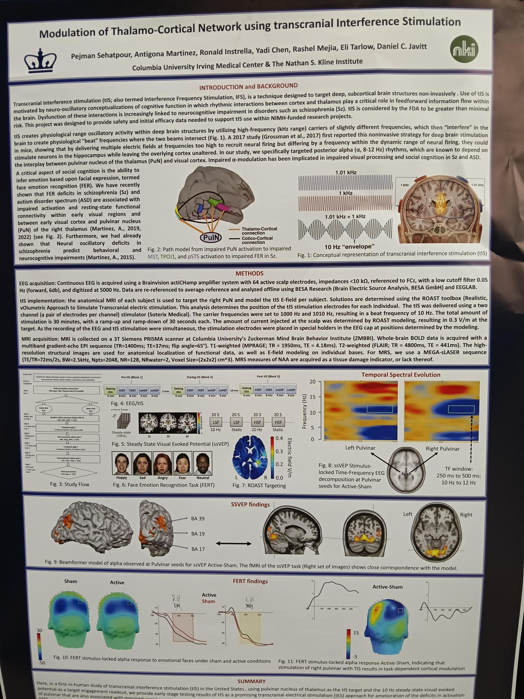

The fields should not be imagined as two narrow beams crossing at a point.
Instead:

* each electrode pair produces a broad quasi-static field;
* the local vector sum changes throughout the head;
* the envelope-modulation amplitude depends on local field magnitudes and orientations;
* current ratios and electrode geometry can shift the envelope maximum.

### Nir Grossman, PhD - *The Biophysical Mechanism of TI Stimulation* ([video](https://youtu.be/GPWoXaKhs8k)) ⭐️

* efficiency,
* field distribution,
* nonlinear subthreshold mixing.
* Hypothesis noted:
  * neurons may nonlinearly combine subthreshold inputs;
  * this may influence whether downstream neurons fire.
* Open question:
  * What cellular nonlinearity demodulates or otherwise responds to the low-frequency envelope?
  * Does TI need synchronization at the circuit level rather than merely a local membrane response?

---

## 4. TMS, kHz TMS, and ECT

### TMS

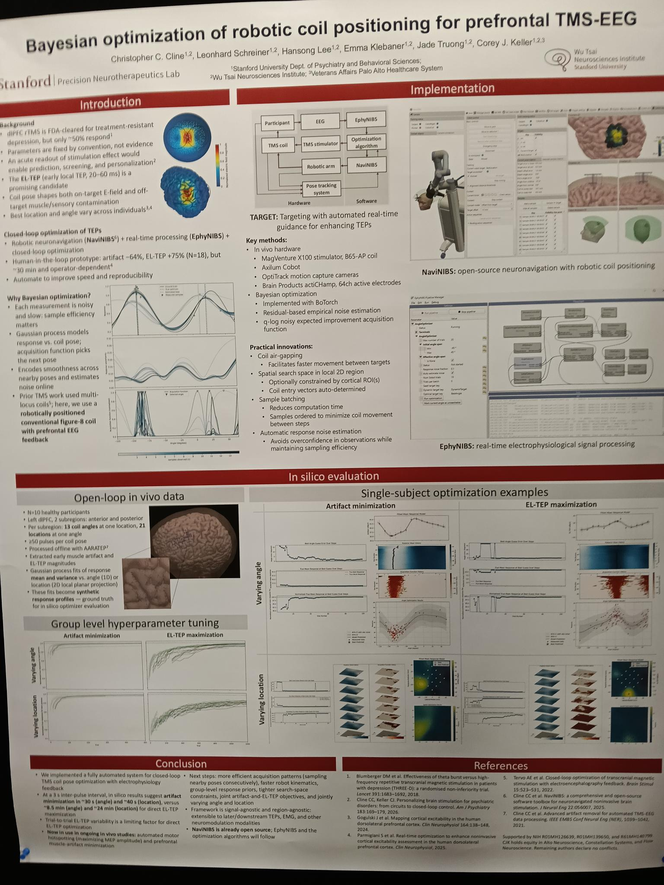

* TMS was discussed in terms of induced intracranial electric fields.
* A **seven-coil TMS** system appeared in the poster session by Dexuan Tang, PhD student, EE.
* Cobot-guided TMS navigation was also presented.
* One practical observation:
  * a patient moved after robotic coil placement, raising questions about motion tracking and robustness.

### Angel Peterchev, PhD - *kHz TMS* ([video](https://youtu.be/83tqcp7rf_A))

* Proposed organizing stimulation modalities by:
  * electric-field amplitude in V/m,
  * electric-field frequency from DC / 1 Hz up to approximately 10 kHz.
* Approximate conceptual range:
  * low, subthreshold fields around $0.1$–$2\ \mathrm{V/m}$,
  * up to roughly $150\ \mathrm{V/m}$ for ECT `[number to verify]`.
* Transcranial electric stimulation causes scalp pain at high amplitudes.
* Strong magnetic stimulation also causes sensation.
* kTMS was described as producing:
  * stronger electric fields than tACS, tDCS, or TI,
  * less sensation than conventional rTMS.

For TMS, “frequency” can refer to pulse-repetition rate, spectral content of each pulse, etc. These should be separated in future notes.

### ECT

* speaker “now we turn up the current from 6 mA to 800 mA to ECT!”
* but note that ECT differs from tES not only in amplitude, but also in:
  * waveform,
  * pulse width,
  * recruitment regime,
  * therapeutic endpoint,
  * and spatial extent.

---

## 5. DBS and Frequency-Dependent Suppression or Potentiation

### Chaitanya Goswami - *From Suppression to Enhancement: Why High-Frequency Deep Brain Stimulation Suppresses but Low-Frequency Potentiates Cortical Activity*

Key message: Your own study might not replicate.

* Initially, high frequency was described as suppressing activity.
* Lower frequency was described as potentiating activity.
* Approximate ranges in the notes:
  * $50$–$100\ \mathrm{Hz}$: potentiation
  * $200\ \mathrm{Hz}$: suppression
* Proposed mechanism for suppression:
  * rate-dependent depression,
  * possible vesicle depletion `[question]`.

### Additional observations

* $140\ \mathrm{Hz}$ DBS:
  * potentiation without spiking
* $40\ \mathrm{Hz}$:
  * induced spiking in rat neurons,
  * produced entrainment in another study.
* Six months of DBS activation was said to help correct an inhibition signal.
* Inter-trial phase coherence was used as a matching measure.

A cautionary tale: The same pulse rate can produce different effects depending on:

* pulse width,
* amplitude,
* axonal orientation,
* synaptic state,
* circuit architecture,
* and stimulation history.

“High frequency suppresses” should remain a hypothesis tied to a specific preparation, not a universal law.

---

## 6. Focused Ultrasound and Acoustic Neuromodulation

### Notes

Ultrasound is a propagating mechanical pressure wave.
Its focus is produced by:

* transducer geometry
* phased-array delays
* aperture size
* focal distance (apparently you don't just need 2 to create a focal point in a circle, but more like ~70, e.g. openwater device)
* acoustic wavelength
* skull-specific phase correction

Primary effects of ultrasound:

* Mechanoreceptor effects: Pressure applied to mechanosensitive ion channels (like a piezo crystal).
* Thermal effects: Localized heating changes membrane capacitance.
* Acoustoelectric Effect. Pressure forces the ions together and causes change in conductivity. pressure -> change in conductivity ($\Delta \sigma = k \sigma P$). then, current. (Refer to Nir Grossman's AE talk)

Focality:

* Curved transducers and phased arrays can create acoustic focal regions.
* Increasing transducer diameter or aperture can narrow the focal spot.
* Brad Treeby noted that as transducer diameter changes, the semicircle/aperture widens and the focal spot becomes smaller.
* The acoustic focus is generally an elongated volume rather than a mathematical point.
* Skull correction and coupling remain major engineering constraints.

### Nir Grossman, PhD - *Non-invasive In Vivo Acoustoelectric Neuromodulation and Its Contribution to Ultrasound Stimulation* ([video](https://youtu.be/lvrK5tD4pyk?si=lHvdpWpD1HjX-sdW)) ⭐️

Research referenced: [Non-invasive in vivo acoustoelectric neuromodulation and its contribution to ultrasound stimulation, by Jean L. Rintoul, Christopher Butler, Robin O. Cleveland & Nir Grossman](https://www.nature.com/articles/s41467-026-73826-2)

* Acoustoelectric effect described as pressure changing conductivity
* $\Delta \sigma = k \sigma P$
* can simulate acoustoelectric field.

Workflow in experiment:

1. Apply an electric field.
2. Apply a focused ultrasound field.
3. Ultrasound locally changes conductivity.
4. The local current or electric-field distribution changes.
5. Read out the effect, for example using EMG from a mouse paw.

1 billion suffering from mental illness

### Modeling

* Gauss’s law was mentioned.
* An acoustoelectric field can be simulated.

### Limitations

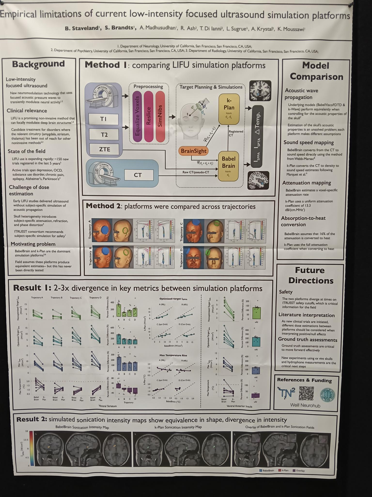

* The acoustoelectric effect was described as weak.
* It may require large ultrasonic fields.
* Important conceptual shift:
  * **phenomenology → mechanism of action**
* Suggested axes:
  * space: circuit motifs,
  * time: quantified brain dynamics.

### other

the tone was educated and reflective, not angry, which made the presentation easy to listen to.

### Kim Butts Pauly, PhD - *Optimized Ultrasound Neuromodulation for Non-invasive Control of Behavior and Physiology*

* free-field intensity `[to review]`
* $145\ \mathrm{ms}$ continuous sonication
* subjects could not distinguish control from sonication of the LGN except when stimulation occurred
* concern:
  * if both control and sonication affect behavior relative to baseline, interpretation becomes difficult;
  * fleeting-dots paradigm: I was in the study; I came up with a cognitive heuristic during the study "learning effect" which might not be captured as a simple metric increase
  * this may matter for fleeting-dots paradigms or anxiety/nervousness effects.

### Shy Shoham, PhD - *Holographic Transcranial Ultrasound Neuromodulation* ([video](https://youtu.be/7pa1KWVqf8Y))

* TUS scaling law:
  * response as a function of pressure and duty cycle,
  * exponential relationship.
* Preprint to review:
  * [bioRxiv preprint](https://www.biorxiv.org/content/10.64898/2026.01.20.700611v2.full)
* Note contained “titanium laser beams” `[likely transcription error; verify]`.
* Two beams were said to create a focal point in a circular TUS geometry `[mechanism to verify]`.

### Xue Han, PhD - *Probe the Cellular and Circuit Mechanisms of Ultrasound and DBS Using Voltage Imaging* ([video](https://youtu.be/HGxkZSV5ePc))

Too much biology for me to understand, please view the (partial) video yourself thanks

* $40\ \mathrm{Hz}$ induced spiking in rat neurons.
* (20%) duty cycle was mentioned.
* Ultrasound may:
  * synchronize,
  * desynchronize,
  * or change potentiation.

### Huiliang Wang, PhD - *Rapid Deep Brain Chemogenetics: Minimally Invasive, Genetically Targeted Deep Brain Stimulation Is Achieved Using Ultrasound-activated Nanocrystals*

* Identified as the same UT Austin researcher who presented at Stanford about HOF and ultrasound

### Brad Treeby, PhD - *Through the Hair: Automated Per-Element Coupling for Deep-Brain Phased-Array Ultrasound Neuromodulation* ([video](https://youtu.be/9GdDrDam1B4))

* Built hardware that blew air through tubes to move hair and improve coupling.
* Creator of the **k-Wave** software.
* Larger effective aperture was associated with a smaller focal spot.

### Openwater

[demo](exhibitions/openwater-demo.mp4)

* Openwater hardware/projects were mentioned.
* Arrays of approximately 128 elements.
* Ultrasound transducers could draw a circle pattern of focal points in water.
* Possible actions:
  * review open-source projects,
  * join the Discord,
  * email community [at] openwater.

### Stavros Zanos, MD - *Focused Ultrasound Neuromodulation of the Spleen Activates an Anti-inflammatory Response*

* Focused ultrasound neuromodulation of the spleen activated an anti-inflammatory response.
* Mechanisms discussed:
  * mechanoreceptor effects,
  * thermal effects,
  * possible electrically relevant effects from pressure and membrane changes.

---

## 7. Ultrasound-Drug Interactions

### Raag Airan, MD, PhD - *Ultrasonic Potentiation of Ketamine Neuromodulation* ([video](https://youtu.be/GGtvJwgEoqw))

### Setup

* IV-guided particle infusion
* image-guided TUS
* “SonoKet” applied ketamine-related modulation in rat brain
* Need to distinguish:
  * SonoKet effects,
  * sham ultrasound effects,
  * ketamine alone,
  * ultrasound alone.
* No significant change in glutamate levels from SonoKet and ultrasound.
* Ultrasound did not change ketamine concentration.
* Ultrasound itself appeared to change the response to ketamine.
* Ultrasound potentiated neurotransmitter-related effects associated with ketamine.
* Possible spatial effects:
  * increased or decreased GABA,
  * frontal versus posterior uncaging differences,
  * mild dopamine increase with posterior uncaging,
  * no change in serotonin.

### Questions

* Why did serotonin not change spatially with posterior uncaging?
* At the lowest perceptible ketamine dose, how far is the system from a dose that damages neurons?
* What is the correct sham condition for a combined ultrasound–drug intervention?

---

## 8. RF and Microwave Neuromodulation

Omid Yaghmazadeh poster 😉

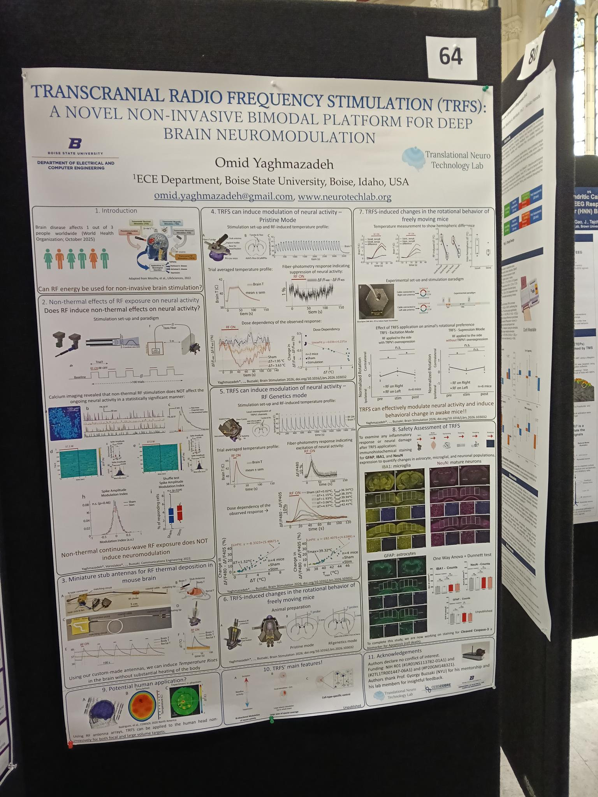

* Literature says it is most often used for ablation, not neuromodulation. There was a singular poster about it.
* Phased RF array used for focusing, like FUS.
* possible to focus using 2, but 8 is often used. Maybe a geometrical relationship between sphere formula

* RF was used instead of ultrasound.
* Frequency around **1 GHz**.
* The mechanism appeared to require a thermal difference for neuromodulation.
* Reported temperature range:
  * approximately $2$–$6^\circ\mathrm{C}$
* Approximately 70 transducers/emitters were used.
* At least eight may have been required for effective focusing.

RF focality is not the same as temporal-interference focality.

* RF/microwave systems can operate in a propagating-wave regime.
* Spatial selectivity may arise from phased-array interference and energy deposition.
* Relevant dose measures may include:
  * electric field,
  * SAR,
  * deposited power,

## Possible project:

* derive or model the geometric relationship governing the minimum number of emitters;
* extend the model up to 128 elements.
* and temperature rise.

### Questions

* Is the biological effect electrical, thermal, or both?
* Does the maximum (E)-field coincide with the maximum temperature?
* How much does thermal diffusion broaden the effective target?
* Why are at least eight emitters needed in the reported geometry?

---

## 9. Nerve Block and Peripheral Stimulation

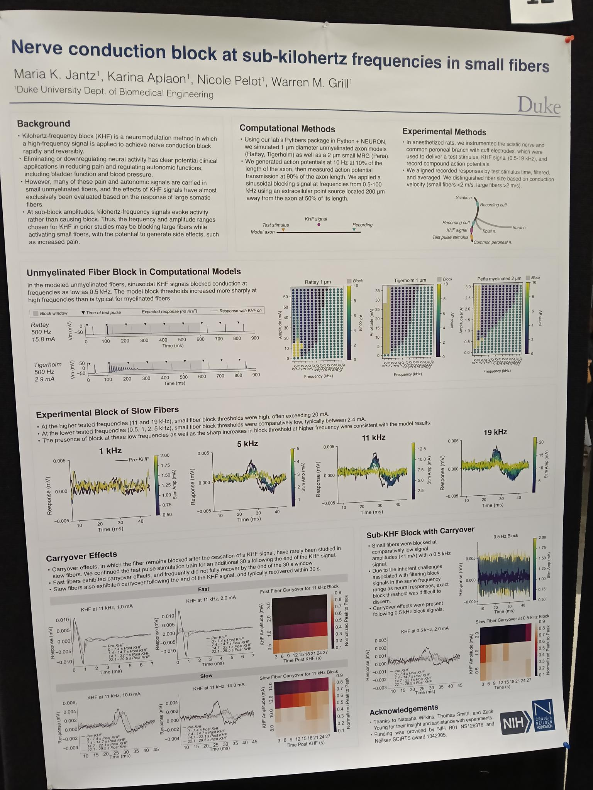

Setup:

* stimulation applied to an axon or nerve,
* at the other end, force transducer measured movement in newtons over time.

Proposed mechanism:

* stimulation causes sodium-channel refractory period and thus a conduction block.

Questions:

* Is block caused by channel inactivation, depolarization block, potassium accumulation, or another mechanism?
* Which frequency, amplitude, pulse width, and duty cycle define the transition from activation to block?
* How does force output map onto neural recruitment?

### Sensorimotor note

* Moving limbs is essential, but sensory feedback is also required from patients. Patients also appreciated sexual function restoration.
* speaker’s presentation style felt angry and aggressively promotional, like anti-AI Jeff Dean lecture protest.

---

## 10. Neurodegeneration, Sleep, and Clearance

### Glymphatic and CSF systems

* The glymphatic clearance system is active during sleep.
* Brain CSF drainage was discussed.
* Open questions:
  * How directly can stimulation modulate clearance?
  * Are reported effects mediated by sleep architecture, vascular changes, neural activity, or mechanical pressure?

### Li-Huei Tsai, PhD - *Neural Substrate Responding to Gamma Frequency Response and Light and Sound Stimulation to Mitigate Dementia*

* neural substrates responding to gamma-frequency light and sound stimulation;
* possible mitigation of dementia-related processes.

Questions:

* Which neural substrate shows gamma-frequency response?
* Is the relevant mechanism entrainment, microglial response, vascular modulation, or sleep-related clearance?
* What is the evidence for behavioral or clinical benefit?

---

## 11. Clinical Targeting, Depression, and Circuit Models

### Shan Siddiqi, MD - *Circuit-targeted Neuromodulation Across Symptoms and Disorders* ([video](https://youtu.be/RXsKdiQOYio)) ⭐️

psychiatrist with “Scott Alexander vibes”

### Target observations

* Anxiosomatic and dysphoric targets appeared not to overlap.
* Anxiosomatic target:
  * shown in red,
  * distributed across the brain.
* Dysphoric target:
  * shown in blue,
  * more centralized near a posterior-right region `[location uncertain]`.
  * What exactly is the dysphoric target? Rumination tends to lead to the same thought, phenologically, after-all.
* Measuring phase differences in iEEG synchronized to phases of depression.
* Six months of DBS activation may correct an inhibition signal.
* Inter-trial phase coherence was used as a matching measure.
* “The brain is not a circuit board.” What does the circuit model actually provide?
* The circuit framing was described as popularized, arguably, by Steven Pinker in 1997 `[historical claim to verify]`.
* Shan argued that symptoms could not simply be diagnosed from circuits.

### working on both map and car in neurotech

**The map gets better:**
* deeper access,
* higher-resolution imaging,
* larger normative datasets,
* larger causal datasets.

**The car gets better:**
* reaching deeper, including FUS,
* greater precision,
* state estimation,
* closed-loop control.

* [Marom Bikson lectures were recommended!](https://www.youtube.com/c/marombikson) Bikson is the organizer of the conference

Hot topics (descriptive, not prescriptive):
* fMRI versus EEG (no! please develop both.)
* how mature each technology actually is
* whether the hardware can reliably aim at precise neuroscience targets
* current amplitude versus current density
* consumer marketing of devices that may not be ready
* contrast between consumer and clinical standards

---

## 12. Imaging, Measurement, and Target Engagement

A recurring recipe across many studies

* hook participant up to a device and stimulate them
* show spatial location using MRI or EEG;
* then report whether a metric increases or decreases;
* behavioral interpretation remains relatively black-box, e.g. see MR-ARFI experiment

For each intervention, distinguish:

1. Device output
2. Physical field in tissue
3. Local physiological response
4. Circuit-level propagation
5. Behavioral effect
6. Clinical outcome

### fNIRS

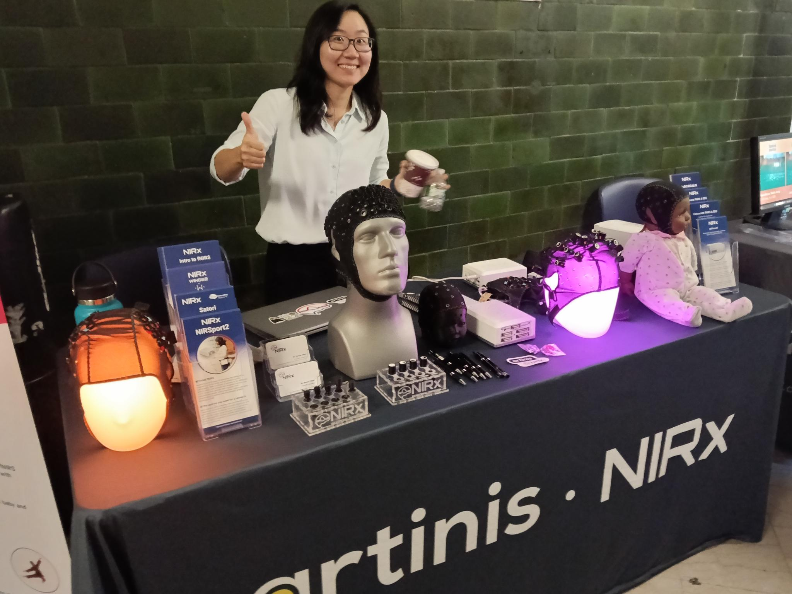

* NIRx had researchers working on smell using fNIRS.
* NIRx provides a closed-source software platform.
* fNIRS was described as having fewer artifacts relative to EEG

---

## 13. Debate: Low Bandwidth versus High Bandwidth 😉

### Jacob Robinson, PhD - *The Case for Low-bandwidth Implantable Neurotechnologies*

* Low bandwidth may support:
  * more market coverage, more users,
  * less invasive or non-invasive devices.
* Critique:
  * engineering constraints were not fully considered;
  * lower-level information insights were missing;
  * presentation felt oriented towards bay area VCs

### Shadi Dayeh, PhD - *The Case for High-bandwidth Implantable Neurotechnologies* ⭐️

Unpublished information redacted. Contact for any disputes/corrections.

* Brain buys bandwidth by the million, while there are $10^8$ axons/carriers in the corpus callosum, optic and corticalspinal has $10^6$ axons. There are only ${\sim}10^2 – {\sim}10^3$ electrodes in arrays.
* Current implantable neural interfaces undersample the nervous system in both space and time. Array bandwidth should approach the bandwidth of the biological phenomenon being measured.

Bandwidth refers to:

* Spatial bandwidth: contact count, density, coverage area, and depth coverage
* Temporal bandwidth: sampling rate and measurable frequency range
* Functional bandwidth: number of neural sources or states that can be distinguished

cortical modules smaller than ECoG spacing

* average functional module diameter: 1.8 mm
* sharp transitions over roughly 200 μm
* smallest observed module: 600 μm
* estimated pitch required to record all units without cross-talk: 0.9 mm

possible existence of still smaller modules

* a 0.32 × 1.28 cm² patch used for phoneme processing
* a proposed 6.4 × 6.4 cm² coverage area for language processing and production
* Maintaining comparable density over the larger area would require approximately 102,400 channels.
* the point is that high density over a tiny patch is not enough for distributed cognition. need both density and area.

* temporal bandwidth around **20 kHz**, contrasted with **250 Hz**;
* $1.8\ \mathrm{mm}$ captures roughly a dozen cortical columns `[verify]`;
* “458 dpi, like iPhone 16” `[analogy from presentation]`;
* somatotopy;
* integrated electronics;
* information-theoretic optimization may make high bandwidth easier to implement.

**Dense sampling reveal structures hidden by coarse arrays**:
Rat whisker cortex - Arrays with approximately 1000 channels/mm² were used to map responses to controller whisker deflections. Different movement directions produced distinct onset-activation regions. Somatotopy is the orderly mapping of body locations onto locations in the nervous system.

**Ideal electrode pitch depends on depth and SNR.**
Dayeh argues that tissue behaves as a spatial low-pass filter: fine spatial structure from deeper sources is attenuated before reaching the recording surface.

$$
\phi(\lambda) = Ae^{-2 \pi \frac{d}{\lambda}}
$$

$A$: amplitude, $d$: depth, $\lambda$: wavelength

Given signal-to-noise ratio $A/\sigma$, the smallest useful spatial wavelength is

$$
\lambda_{\min}=\frac{2\pi d}{\ln(A/\sigma)}
$$

The corresponding spatial Nyquist pitch is

$$
p_{\mathrm{Nyquist}}=\frac{\lambda_{\min}}{2}=\frac{\pi d}{\ln(A/\sigma)}
$$

Example from the slide:

source depth: 100 μm
SNR: 30
required pitch: approximately 90 μm

Thus the intuition is:

* Shallower source → narrower surface footprint → finer pitch required.
* Deeper source → broader footprint → coarser pitch may suffice.
* Higher SNR → weaker high-spatial-frequency components remain measurable → finer pitch becomes useful.
* Lower SNR → noise erases those components → ultrafine pitch may add little.

temporal sampling near 20 kHz provides a large benefit over 250 Hz, while current spatial bandwidth remains below the ideal.

tl;dr Bandwidth buys specificity. Up to the bandwidth of the neural phenomenon itself, increasing array bandwidth increases the capacity to separate sources. Current interfaces leave information on the table because they undersample spatial structure, temporal dynamics, or both.

thought process:

* The CNS contains orders of magnitude more parallel signal pathways than present arrays have channels.
* Functionally distinct cortical modules can exist at submillimeter scales.
* Denser arrays reveal modules, propagation patterns, and somatotopy hidden by coarse sampling.
* The ideal pitch depends on source depth and SNR, so density should be engineered rather than maximized blindly.
* Dense sampling enables spatial filtering, improving SNR and localization.
* High temporal sampling is also necessary for fast neural phenomena.

### Questions from the discussion

* How do transmission errors affect usable bandwidth?
* Are humans “living at 10 bits/s,” e.g. processing information at this rate or is that an artifact of task design?
* Response from the speaker:
  * neural processes are not limited to 10 bits/s, this is a strawman argument;
  * some tasks operate at substantially higher rates.
* What is the maximum-bandwidth “game” that can be played? Callback to NeurotechX hackathon
* How should bandwidth be traded against:
  * algorithms,
  * longevity,
  * invasiveness,
  * power,
  * heat,
  * and reliability?
* What is the actual marginal information gain per added channel after accounting for correlated signals?
* When does denser sampling become limited by electrode noise, tissue response, wiring, heat, power, telemetry, or computation?
* How should spatial density vary across an array when source depth is heterogeneous?
* Can adaptive or nonuniform layouts approach the information yield of uniform ultra-high-density arrays with fewer channels?
* “higher pitch improves SNR” is kinda ambiguous: in electrode engineering, finer/smaller pitch usually means higher density. The visual argument appears to favor finer sampling rather than larger electrode spacing.

---

## 14. Modeling, Optimization, and Algorithms

### Acquisition and sampling

* Probability of improvement acquisition function
* Sampling algorithms:
  * greedy,
  * epsilon-greedy,
  * Gaussian-process regression,
  * Thompson sampling

Bayesian optimization stuff:

* [Bayesian optimization resources](https://drive.google.com/drive/folders/11UoUSp0-lumolk7H4atpBm5W0jYMBYNM)
* [Bayesian optimization paper](https://arxiv.org/abs/1012.2599)
* Confused why beta was not a parameter to vary

### Temporal modeling

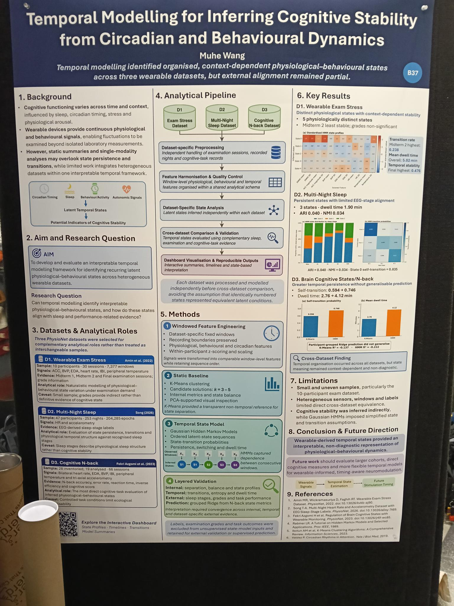

### Neural operators 😉

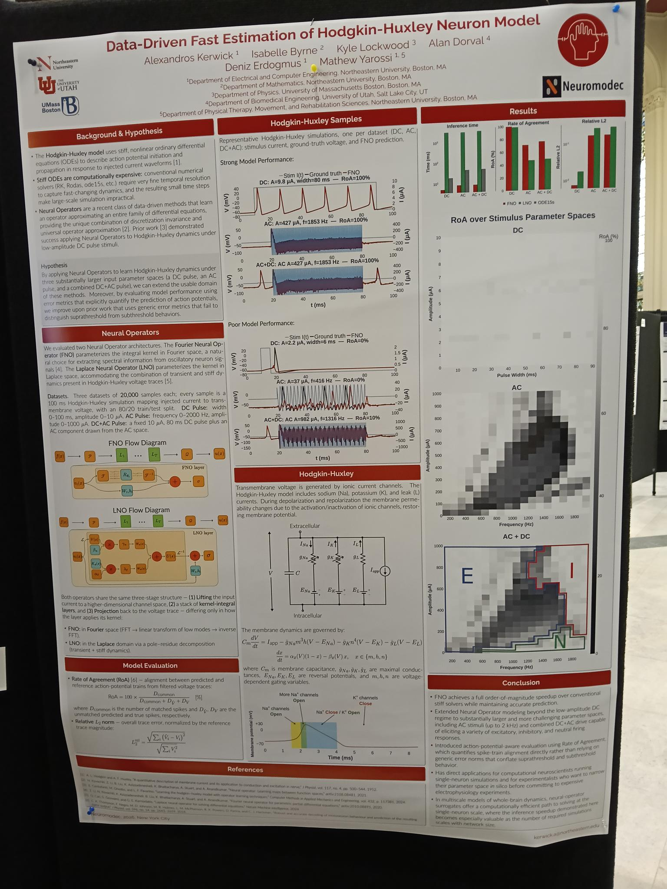

* neural operators used to estimate an appropriate function within a Hodgkin–Huxley neuron model;
* neural operators were described as neural networks that learn families of functions.

### Closed-loop modeling

* closed-loop EEG neuromodulation algorithm from simulations;
* optimization of electrode geometry;
* individual versus group-level protocol optimization;
* possible use of the Allen connectivity atlas for network-level modeling.

### Neuroanalysis pipeline recipe

1. Visualize modalities using structural and functional imaging.
2. Transform neural signals into frequency-domain representations.
3. Separate:
  * neuronal,
  * circuit,
  * behavioral levels.
4. Apply:
  * linear models,
  * regression,
  * dimensionality reduction.
5. Evaluate:
  * human performance,
  * model-organism performance,
  * increase or decrease relative to baseline.

---

## 15. Bioelectronic Medicine and GI Stimulation

### FLASH capsule

* Gut stimulation has historical roots going back to the 1950s.
* FLASH:
  * bioinspired ingestible,
  * fluid-wicking capsule,
  * actively stimulates mucosal tissue,
  * modulates an orexigenic GI hormone systemically.

Quoted summary from notes:

> A bioinspired ingestible fluid-wicking capsule rapidly wicks fluid and locally stimulates mucosal tissue, producing systemic modulation of an orexigenic GI hormone.

### Broader theme

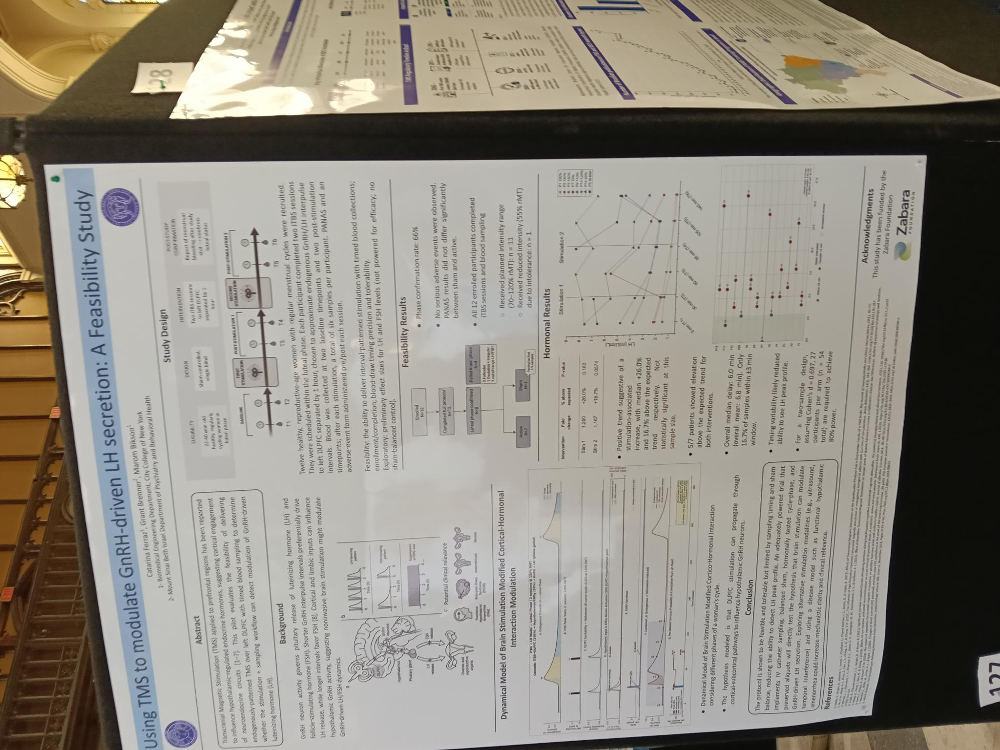

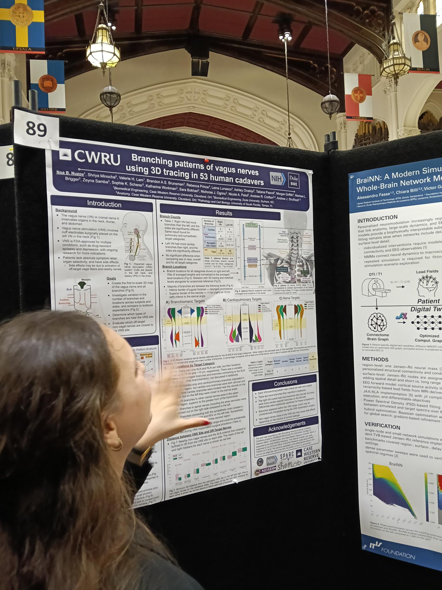

Bioelectronic interventions can target:

* brain,
* peripheral nerves,
* spleen,
* gut,
* endocrine signaling.

This widens the neuromodulation frame beyond central nervous system

---

## 16. People list

### Speakers

* Li-Huei Tsai
* Chaitanya Goswami
* Jacob Robinson
* Shadi Dayeh
* Shy Shoham
* Xue Han
* Huiliang Wang
* Raag Airan
* Brad Treeby
* Stavros Zanos
* Angel Peterchev
* Nir Grossman
* Shan Siddiqi
* Marom Bikson

### Talk or session topics

* Dysphoric versus anxiosomatic TMS targets
* Gamma-frequency light and sound stimulation for dementia
* Low-bandwidth versus high-bandwidth implantable neurotechnology
* MR-ARFI
* Deep-brain phased-array ultrasound through hair
* kHz TMS
* Temporal interference biophysics
* Acoustoelectric stimulation
* Focused ultrasound of the spleen
* Ultrasound-potentiated ketamine neuromodulation

---

## 17. Questions to look into to understand neuromodulation

### Focality/dose

* What is the depth–focality scaling law for each modality?
* Frameworks to compare modalities be compared across incompatible amplitude units?
* How is focal volume defined?
* When does network propagation dominate over the local physical focus?
* Can target dose be normalized using energy, polarization, or predicted firing probability?
* How does uncertainty in tissue properties propagate into targeting error?

### Temporal interference

* What exactly demodulates the kHz carrier?
* Is TI primarily a membrane, axonal, synaptic, or circuit phenomenon?
* How much of the target engagement is explained by envelope amplitude alone?
* What is the effect of vector orientation?
* Can closed-loop TI optimize phase and current ratios in real time?

### Ultrasound

* What is the said scaling laws relating:
  * pressure,
  * duty cycle,
  * focal volume,
  * temperature,
  * neural response
  * response decay?
* How should mechanical and thermal mechanisms be separated experimentally?
* What does a $90\ \mu\mathrm{s}$ pulse do at the membrane level?
* How does aperture size determine focal width through the skull?

### RF

* Why might at least eight emitters be needed?
* What is the relationship between array geometry and focal volume?
* Can neural operators accelerate field and thermal simulations?
* Does neuromodulation depend on temperature rise, field strength, or both?

### Interfaces

* What is the maximum useful bandwidth after accounting for errors, longevity, power, and decoding?
* How does electrode count change error rate?
* How should electrode pitch scale with depth and SNR?
* Which tasks genuinely require high-bandwidth interfaces?

### Clinical neuroscience

* What is the dysphoric TMS target?
* How distinct are anxiosomatic and dysphoric symptom circuits?
* Can circuit models predict symptoms prospectively?
* Which target-engagement measures are causal rather than correlational?

---

## 18. Project Ideas

### Modeling and simulation

* Optimize electrode geometry for tES and TI.
* Model arrays from 8 to 128 elements.
* Study scaling laws for transcranial ultrasound stimulation.
* Model TI envelope amplitude and vector orientation.
* Compare group-level versus individualized tES optimization.
* Reproduce the NERMI error analysis.
* Build a closed-loop EEG neuromodulation simulation.
* Use neural operators for Hodgkin–Huxley or field-solver surrogates.
* Derive the relationship between RF array geometry and the minimum number of emitters.
* Explore information-theoretic optimization of neural-interface bandwidth.
* Quantify how transmission errors reduce effective bandwidth.

### Hardware and implementation

* Review Openwater open-source projects.
* Build or test a low-cost tDCS system.
* Join the Openwater Discord.
* Investigate automated ultrasound coupling through hair.
* Explore multi-coil TMS and robotic navigation.

### Reading

* Shadi Dayeh presentation pdf
* Shy Shoham TUS scaling paper:
  * [bioRxiv preprint](https://www.biorxiv.org/content/10.64898/2026.01.20.700611v2.full)
* Acoustoelectric paper:
  * [Communications Physics paper](https://www.nature.com/articles/s42005-023-01198-w)
* Bayesian optimization workshop paper:
  * [arXiv paper](https://arxiv.org/abs/1012.2599)
* Marom Bikson:
  * [YouTube channel](https://www.youtube.com/c/marombikson)
* Openwater:
  * [GitHub organization](https://github.com/OpenwaterHealth)

---

## 19. Logistics and Contacts

* Neural engineering member directory:
  * [Member directory](https://www.neuralengr.org/members)
* Adrian Tomby, a vibey student researcher at above engineering lab, is presenting a poster on Sunday on the study of caffeine.
* Ashlesha from Neuralink:
  * seemed funny,
  * also seemed to be suffering
* Posters of interest:
  * A16
  * B71
* Bioelectronics exhibition:
  * Sept 28–29 in New York City,
  * abstracts due Aug 9, 2026
* 7th International Brain Stimulation Conference (February 21–24, 2027)
  * Abstract submission Aug 28 2026
* Future conference logistics:
  * bring a tripod,
  * prepare a faster video-upload workflow.
* Slide-generation tool noted:
  * Gamma.ai was too frequently used
